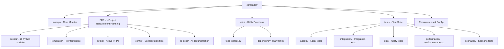
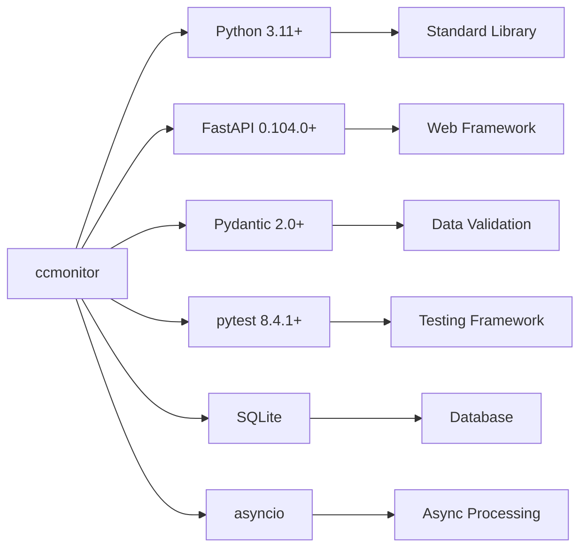
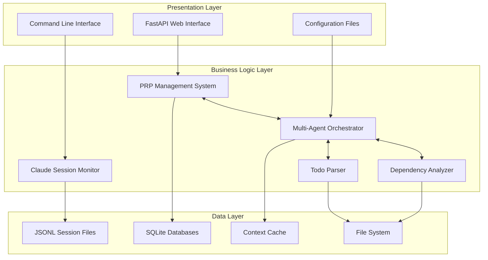
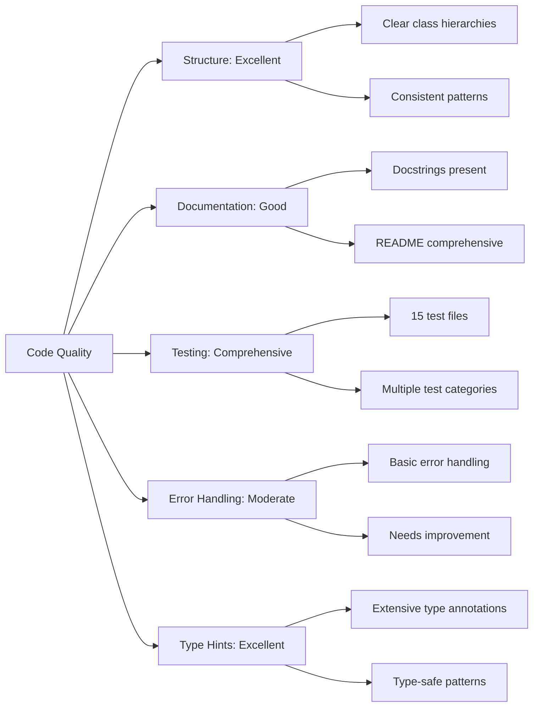
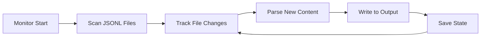
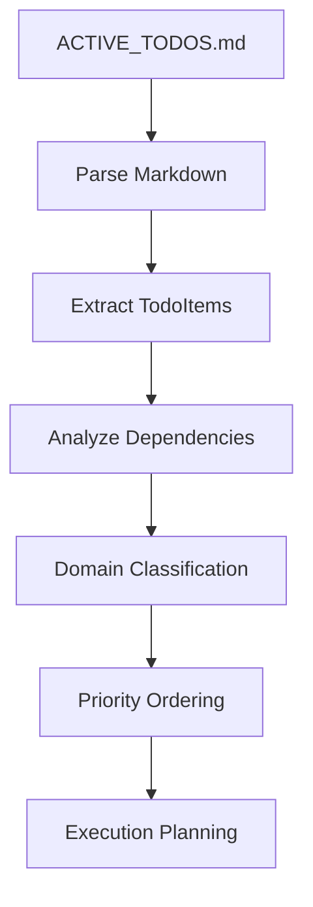
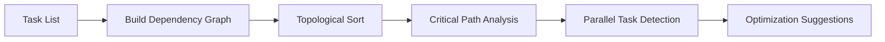
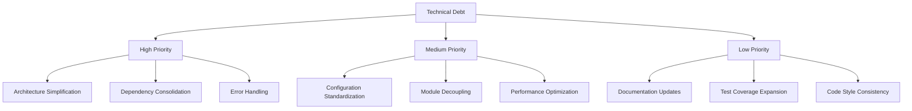

# CCMonitor Project - Comprehensive Technical Analysis

**Analysis Date**: August 2, 2025  
**Project Version**: 0.1.0  
**Total Lines of Code**: 18,513 (excluding virtual environment)  
**Test Files**: 15  
**Primary Language**: Python 3.11+  

## Executive Summary

The CCMonitor project is a sophisticated AI-powered development environment that represents a significant evolution from a simple Claude Code session file monitor into a comprehensive "Claude Agents" system. The project implements a Test-Driven Development (TDD) first approach with autonomous AI agents, machine learning-enhanced workflows, and intelligent project management capabilities.

### Key Findings

- **Architecture**: Complex multi-layered system with PRP (Project Requirement Planning) at its core
- **Scale**: Large codebase with 18,513+ lines of Python code across multiple modules
- **Testing**: Comprehensive test coverage with 15 test files covering unit, integration, and scenario testing
- **Innovation**: Implements novel concepts like "context is non-negotiable" philosophy and 4-level validation loops
- **Quality**: High code quality with structured patterns, extensive documentation, and security considerations

### Major Recommendations

1. **Simplify Core Functionality**: The original monitoring purpose has been overshadowed by complex features
2. **Modularize Architecture**: Break down monolithic scripts into smaller, focused modules
3. **Improve Documentation**: Bridge the gap between README ambitions and actual implementation
4. **Standardize Dependencies**: Consolidate dependency management approach
5. **Enhance Error Handling**: Implement more robust error handling across all modules

## Project Structure Analysis

### Directory Organization



### File Distribution Analysis

| Category | File Count | Lines of Code | Purpose |
|----------|------------|---------------|---------|
| **Core Application** | 1 | 325 | Main monitoring functionality |
| **PRP System** | 16 | ~12,000 | Project requirement planning and orchestration |
| **Utilities** | 2 | ~713 | Todo parsing and dependency analysis |
| **Tests** | 15 | ~5,000 | Comprehensive testing framework |
| **Configuration** | 5 | ~500 | Project setup and dependencies |

### Naming Conventions

- **Consistent Python Naming**: snake_case for functions and variables, PascalCase for classes
- **Descriptive Module Names**: Clear purpose indication (`todo_parser.py`, `dependency_analyzer.py`)
- **Test Naming**: Standard `test_*.py` pattern for all test files
- **Configuration Separation**: Clear separation between development and production configs

## Dependencies & Technology Stack Analysis

### Core Dependencies



### Dependency Categories

#### Production Dependencies (pyproject.toml)
- **Web Framework**: FastAPI 0.104.0+ (modern async web framework)
- **Data Processing**: numpy 1.24.0+, scikit-learn 1.3.0+ (ML capabilities)
- **Data Validation**: pydantic 2.0+, jsonschema 4.25.0+ (robust data handling)
- **Database**: sqlite-utils 3.38+ (lightweight database operations)
- **Utilities**: psutil 7.0.0+, python-dateutil 2.9.0+, pyyaml 6.0+
- **Performance**: orjson 3.11.1+, regex 2025.7.34+ (optimized JSON and regex)
- **Logging**: structlog 25.4.0+ (structured logging)
- **Web Server**: uvicorn 0.24.0+ (ASGI server)

#### Development Dependencies
- **Testing**: pytest 8.4.1+, pytest-asyncio 0.23.0+ (async testing support)

#### Architecture Observations
- **Modern Stack**: Uses contemporary Python tools and frameworks
- **Performance Focus**: Includes optimization libraries (orjson, regex)
- **ML Ready**: Includes machine learning dependencies
- **Testing Emphasis**: Comprehensive testing framework setup
- **Production Ready**: Includes production-grade web server

### Dependency Management Issues

1. **Dual Dependency Files**: Both `pyproject.toml` and `requirements.txt` exist with minimal overlap
2. **Version Constraints**: Appropriate minimum version constraints but may need upper bounds
3. **Missing Development Dependencies**: Some development tools referenced in code are not declared

## Architecture & Design Patterns Analysis

### System Architecture Overview



### Core Design Patterns Identified

#### 1. **Strategy Pattern** (Template System)
```python
# PRP Template Selection Strategy
class TemplateSelector:
    def select_optimal_template(self, requirements) -> Template
    # Multiple template strategies: tdd_base, red_green_refactor, etc.
```

#### 2. **Observer Pattern** (File Monitoring)
```python
# ClaudeCodeMonitor observes file system changes
class ClaudeCodeMonitor:
    def check_for_changes(self) -> None
    # Observes JSONL files for modifications
```

#### 3. **Factory Pattern** (Agent Creation)
```python
# Multi-agent orchestration factory
class MultiAgentOrchestrator:
    def create_agent(self, agent_type) -> Agent
    # Creates specialized agents based on type
```

#### 4. **Builder Pattern** (PRP Creation)
```python
# PRPCreator builds complex PRP documents
class PRPCreator:
    def create_api_prp(self, **kwargs) -> PRP
    # Builds PRPs step by step
```

#### 5. **Command Pattern** (Task Execution)
```python
# TaskNode represents executable commands
@dataclass
class TaskNode:
    id: str
    name: str
    estimate_hours: float
    dependencies: List[str]
```

### Architectural Strengths

1. **Separation of Concerns**: Clear separation between monitoring, parsing, analysis, and orchestration
2. **Modularity**: Well-organized module structure with specific responsibilities
3. **Extensibility**: Plugin-like architecture for agents and templates
4. **Testability**: Clean interfaces that facilitate unit testing
5. **Configuration-Driven**: Flexible configuration system

### Architectural Concerns

1. **Complexity Creep**: Simple monitor has evolved into complex AI orchestration system
2. **Tight Coupling**: Some modules have circular dependencies
3. **Mixed Abstractions**: File monitoring mixed with AI agent orchestration
4. **Scale Mismatch**: Heavy ML infrastructure for simple file monitoring

## Code Quality & Maintainability Analysis

### Code Quality Metrics



### Code Quality Strengths

#### 1. **Excellent Type Safety**
```python
# Comprehensive type hints throughout
from typing import Dict, List, Optional, Set, Tuple, Any, Callable
def parse_active_todos(todos_path: Path) -> List[TodoItem]:
```

#### 2. **Well-Structured Classes**
```python
@dataclass
class TodoItem:
    """Structured todo representation from ACTIVE_TODOS.md"""
    id: str
    title: str
    description: str
    priority: str
    # ... comprehensive field definitions
```

#### 3. **Comprehensive Documentation**
- Detailed docstrings for classes and methods
- Clear module-level documentation
- Extensive README with usage examples

#### 4. **Robust Testing Framework**
- Unit tests for core functionality
- Integration tests for component interaction
- Performance tests for optimization
- Scenario tests for end-to-end validation

### Areas for Improvement

#### 1. **Error Handling**
```python
# Current basic error handling
except Exception as e:
    logger.error(f"Error parsing todos file: {e}")
    return []

# Recommended: More specific exception handling
except FileNotFoundError:
    logger.warning(f"Todos file not found: {todos_path}")
    return []
except PermissionError:
    logger.error(f"Permission denied reading: {todos_path}")
    raise
except json.JSONDecodeError as e:
    logger.error(f"Invalid JSON in todos file: {e}")
    return []
```

#### 2. **Configuration Management**
- Multiple configuration systems (YAML, env vars, hardcoded values)
- Inconsistent configuration access patterns
- Missing validation for configuration values

#### 3. **Dependency Injection**
- Hard-coded dependencies in some modules
- Difficult to test in isolation
- Tight coupling between components

## Functionality Analysis

### Core Features

#### 1. **Claude Session Monitoring** (main.py)


**Purpose**: Monitor Claude Code session files for changes and extract new content
**Key Features**:
- Real-time file system monitoring
- Incremental content extraction
- State persistence between runs
- Multiple operation modes (process-all, since-last-run, continuous)

#### 2. **Todo Management System** (utils/todo_parser.py)


**Purpose**: Parse and manage project todos with sophisticated metadata extraction
**Key Features**:
- Markdown parsing with metadata extraction
- Dependency analysis and validation
- Domain area classification (python, javascript, api, etc.)
- Priority-based task scheduling
- PRP integration hooks

#### 3. **Dependency Analysis** (utils/dependency_analyzer.py)


**Purpose**: Analyze task dependencies and optimize execution order
**Key Features**:
- Dependency graph construction
- Circular dependency detection
- Critical path calculation
- Parallel execution opportunities
- Task scheduling optimization

#### 4. **PRP (Project Requirement Planning) System**
**Purpose**: Implement TDD-first project management with AI agent orchestration
**Key Features**:
- Template-based PRP creation
- Multi-agent task orchestration
- 4-level validation framework
- Context injection and management
- Knowledge sharing between agents

### Feature Assessment

#### Strengths
1. **Comprehensive Todo Management**: Sophisticated parsing and analysis capabilities
2. **Dependency Intelligence**: Advanced dependency analysis with optimization
3. **Monitoring Capability**: Effective file monitoring with state management
4. **Extensible Architecture**: Plugin-based system for agents and templates

#### Concerns
1. **Feature Scope Creep**: Original monitoring purpose lost in complex AI features
2. **Over-Engineering**: Simple file monitoring doesn't require ML orchestration
3. **Complexity vs. Value**: High complexity for relatively simple core functionality
4. **Resource Requirements**: Heavy system requirements for basic monitoring

## Technical Debt & Recommendations

### Technical Debt Assessment



### Critical Recommendations

#### 1. **Simplify Core Architecture** (High Priority)
**Problem**: The simple file monitor has evolved into a complex AI orchestration system
**Recommendation**: 
- Extract core monitoring functionality into a lightweight module
- Move PRP system to a separate project or optional add-on
- Create clear separation between monitoring and AI features

#### 2. **Consolidate Dependency Management** (High Priority)
**Problem**: Inconsistent dependency declarations between `pyproject.toml` and `requirements.txt`
**Recommendation**:
```toml
# Standardize on pyproject.toml with dependency groups
[project.optional-dependencies]
dev = ["pytest>=8.4.1", "black", "mypy", "ruff"]
ml = ["scikit-learn>=1.3.0", "numpy>=1.24.0"]
web = ["fastapi>=0.104.0", "uvicorn>=0.24.0"]
```

#### 3. **Improve Error Handling** (High Priority)
**Problem**: Basic exception handling with insufficient specificity
**Recommendation**:
```python
# Implement specific exception classes
class CCMonitorError(Exception):
    """Base exception for CCMonitor"""
    pass

class FileMonitoringError(CCMonitorError):
    """Error in file monitoring operations"""
    pass

class TodoParsingError(CCMonitorError):
    """Error in todo parsing operations"""
    pass
```

#### 4. **Standardize Configuration** (Medium Priority)
**Problem**: Multiple configuration systems and inconsistent access
**Recommendation**:
```python
# Centralized configuration management
@dataclass
class CCMonitorConfig:
    projects_dir: Path
    output_file: Path
    check_interval: int
    log_level: str
    
    @classmethod
    def from_file(cls, config_path: Path) -> 'CCMonitorConfig':
        # Load from YAML/TOML configuration
```

#### 5. **Modularize PRP System** (Medium Priority)
**Problem**: PRP system is tightly coupled with monitoring functionality
**Recommendation**:
- Extract PRP system to separate package
- Create clean API between monitoring and PRP features
- Allow optional installation of PRP features

### Refactoring Opportunities

#### 1. **Extract Monitoring Core**
```python
# Simplified monitoring interface
class ClaudeSessionMonitor:
    def __init__(self, config: MonitorConfig):
        self.config = config
    
    def start_monitoring(self) -> None:
        """Start file monitoring loop"""
    
    def process_changes(self, files: List[Path]) -> List[Change]:
        """Process file changes and return structured data"""
```

#### 2. **Plugin Architecture for Extensions**
```python
# Plugin interface for extensibility
class CCMonitorPlugin:
    def on_file_change(self, change: FileChange) -> None:
        """Handle file change events"""
    
    def on_session_start(self) -> None:
        """Handle session start events"""
```

#### 3. **Configuration Validation**
```python
# Pydantic configuration validation
class MonitorConfig(BaseModel):
    projects_dir: Path = Field(default_factory=lambda: Path.home() / ".claude" / "projects")
    output_file: Path = Field(default="claude_session_changes.txt")
    check_interval: int = Field(default=5, ge=1, le=3600)
    
    @validator('projects_dir')
    def validate_projects_dir(cls, v):
        if not v.exists():
            raise ValueError(f"Projects directory does not exist: {v}")
        return v
```

### Best Practices Implementation

#### 1. **Logging Standardization**
```python
# Structured logging with context
import structlog

logger = structlog.get_logger(__name__)

def monitor_file_changes(self):
    logger.info("Starting file monitoring", 
               projects_dir=str(self.projects_dir),
               check_interval=self.check_interval)
```

#### 2. **Type Safety Enhancement**
```python
# Comprehensive type definitions
from typing import TypedDict, Literal, Protocol

class FileChangeEvent(TypedDict):
    file_path: str
    change_type: Literal['created', 'modified', 'deleted']
    timestamp: datetime
    size_change: Optional[int]

class FileMonitor(Protocol):
    def watch(self, directory: Path) -> Iterator[FileChangeEvent]:
        ...
```

#### 3. **Testing Strategy**
```python
# Comprehensive test coverage
class TestClaudeMonitor:
    def test_file_monitoring_basic(self):
        """Test basic file monitoring functionality"""
    
    def test_file_monitoring_edge_cases(self):
        """Test edge cases like permission errors, missing files"""
    
    def test_incremental_processing(self):
        """Test incremental file processing"""
    
    @pytest.mark.integration
    def test_end_to_end_monitoring(self):
        """Test complete monitoring workflow"""
```

## Implementation Roadmap

### Phase 1: Core Stabilization (2-3 weeks)
1. **Extract Core Monitoring**: Simplify main.py to focus on file monitoring
2. **Consolidate Dependencies**: Standardize on pyproject.toml
3. **Improve Error Handling**: Implement specific exception classes
4. **Configuration Cleanup**: Centralize configuration management

### Phase 2: Architecture Cleanup (3-4 weeks)
1. **Modularize PRP System**: Extract to separate package
2. **Plugin Architecture**: Implement plugin interface for extensions
3. **API Design**: Create clean interfaces between components
4. **Documentation Update**: Align documentation with actual implementation

### Phase 3: Enhancement (4-6 weeks)
1. **Performance Optimization**: Optimize file monitoring and processing
2. **Enhanced Testing**: Expand test coverage and add performance tests
3. **Configuration Validation**: Implement comprehensive config validation
4. **Production Readiness**: Add monitoring, alerting, and deployment features

## Conclusion

The CCMonitor project represents an ambitious evolution from a simple Claude Code session monitor into a comprehensive AI-powered development environment. While the technical implementation demonstrates strong engineering skills and innovative concepts, the project suffers from significant complexity creep that may hinder its primary monitoring purpose.

### Key Strengths
- **Technical Excellence**: High-quality code with excellent type safety and testing
- **Innovation**: Novel concepts like PRP system and AI agent orchestration
- **Comprehensive Features**: Extensive functionality for project management
- **Modern Stack**: Contemporary Python tools and frameworks

### Primary Challenges
- **Complexity vs. Purpose**: Over-engineered for core monitoring functionality
- **Feature Scope**: Unclear boundaries between monitoring and AI features
- **Resource Requirements**: Heavy system requirements for basic functionality
- **Maintainability**: Complex codebase may be difficult to maintain

### Strategic Recommendations
1. **Simplify Core**: Focus on excellent file monitoring as the primary value proposition
2. **Modularize Features**: Extract AI features to optional components or separate projects
3. **Clear Documentation**: Align documentation with actual implementation and use cases
4. **Gradual Enhancement**: Implement improvements incrementally to maintain stability

The project shows significant potential but would benefit from architectural simplification and clearer focus on its core value proposition as a Claude Code session monitor.