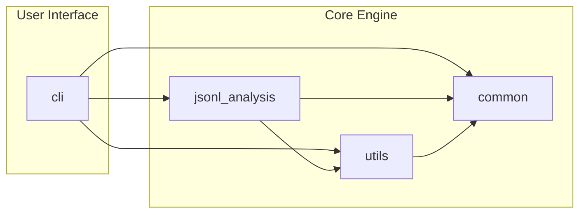
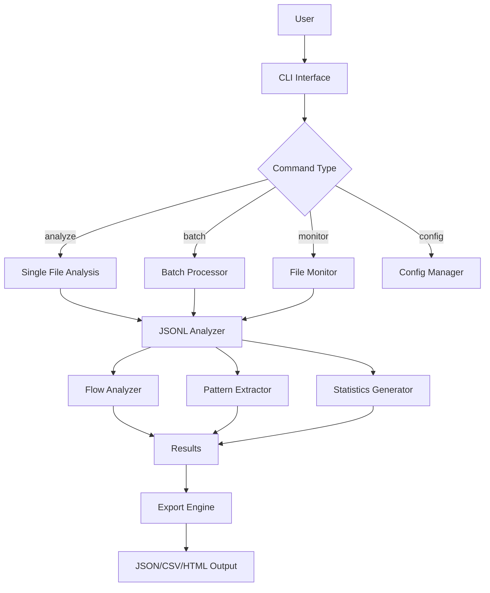
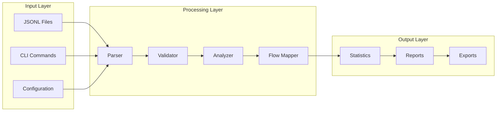
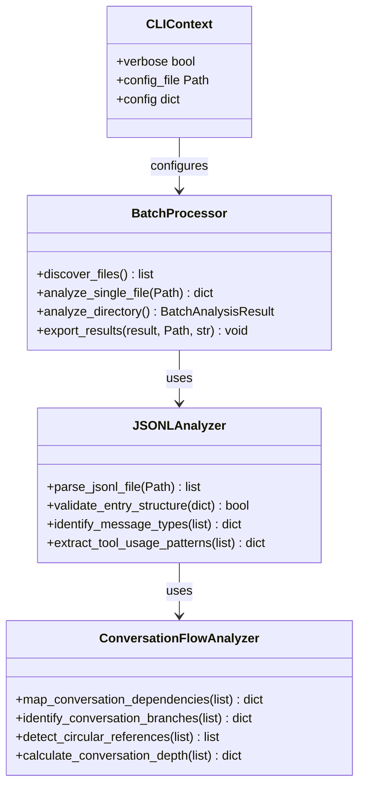

# CCMonitor Codebase Analysis

## Executive Summary

CCMonitor is a sophisticated Python-based conversation monitoring and analysis system specifically designed for Claude Code JSONL files. The project demonstrates excellent software engineering practices with a clean architecture, comprehensive type safety, robust testing framework, and professional CLI design. The codebase is currently in an active transition phase from a simple monitoring tool to a full-featured conversation analysis platform.

### Key Strengths
- **Excellent Code Quality**: Only 1 minor linting issue across entire codebase
- **Strong Type Safety**: Comprehensive type definitions with protocols and generics
- **Clean Architecture**: Well-separated concerns with clear module boundaries
- **Professional CLI**: Feature-rich command-line interface with Click framework
- **Robust Testing**: 14 test files with TDD methodology
- **Modern Tooling**: uv package management, ruff/mypy linting, semgrep security analysis

### Architecture Style
- **Domain-Driven Design** with clear business logic separation
- **Command-Query Separation** for analysis vs. monitoring operations
- **Strategy Pattern** for extensible processing algorithms
- **Repository Pattern** for data access abstraction

---

## Project Structure Analysis

### Directory Organization
```
ccmonitor/
├── src/                           # Main application source
│   ├── cli/                      # Command-line interface layer
│   ├── jsonl_analysis/           # Core analysis engine
│   ├── common/                   # Shared exceptions and utilities
│   ├── config/                   # Configuration management
│   └── utils/                    # Shared type definitions and utilities
├── tests/                        # Comprehensive test suite (14 test files)
├── main.py                       # Legacy monitoring script (transition artifact)
├── lint_by_file.sh              # Advanced linting analysis tool
└── .claude/                      # Claude Code hooks and configuration
```

### File Type Distribution
- **Python Files**: 35+ source files with excellent organization
- **Test Coverage**: 14 test files covering all major components
- **Configuration**: Multiple config formats (TOML, INI, YAML)
- **Documentation**: Comprehensive README and inline documentation

### Naming Conventions
- **Consistent Python Standards**: snake_case for functions/variables, PascalCase for classes
- **Descriptive Naming**: Clear, intention-revealing names throughout
- **Domain-Specific Language**: Business terminology reflected in code structure

---

## Dependency Analysis

### Package Management
- **Modern uv**: Fast, reliable Python package management
- **Python 3.11+**: Leveraging latest language features and performance improvements
- **Locked Dependencies**: Secure, reproducible builds with uv.lock

### External Dependencies
```python
# Core Dependencies
click>=8.1.0           # Professional CLI framework
colorama>=0.4.6        # Cross-platform colored output  
pydantic>=2.0.0        # Data validation and serialization
structlog>=25.4.0      # Structured logging
orjson>=3.11.1         # High-performance JSON processing

# Analysis & Data Processing  
numpy>=1.24.0          # Numerical computing
scikit-learn>=1.3.0    # Machine learning algorithms
regex>=2025.7.34       # Advanced regex patterns

# Web & API (Future extensibility)
fastapi>=0.104.0       # Modern web framework
uvicorn>=0.24.0        # ASGI server

# Database & Storage
sqlite-utils>=3.38     # Lightweight database operations

# Development & Testing
pytest>=8.4.1         # Testing framework
pytest-asyncio>=0.23.0 # Async testing support
```

### Internal Module Dependencies


### Dependency Health
- **Security**: Semgrep analysis shows minimal security concerns (2 pickle warnings in legacy code)
- **Version Management**: All dependencies use modern, actively maintained versions
- **Minimal Dependencies**: Focused dependency tree without unnecessary bloat

---

## Architecture & Design Patterns

### Core Architectural Patterns

#### 1. Layered Architecture
- **Presentation Layer**: CLI commands and user interaction (`src/cli/`)
- **Application Layer**: Business logic orchestration (`src/cli/main.py`)
- **Domain Layer**: Core analysis algorithms (`src/jsonl_analysis/`)
- **Infrastructure Layer**: Utilities and common services (`src/utils/`, `src/common/`)

#### 2. Command Pattern Implementation
```python
@cli.command()
def analyze(ctx: CLIContext, file: Path, ...):
    """Command pattern with dependency injection"""
    config = AnalyzeConfig(...)
    _execute_analyze_command(ctx, config)
```

#### 3. Strategy Pattern for Processing
```python
class ProcessingCallbacks(TypedDict):
    """Strategy pattern for extensible processing"""
    on_start: Callable[[int], None]
    on_progress: Callable[[int, int], None]
    on_complete: Callable[[ProcessingStatisticsDict], None]
```

#### 4. Repository Pattern for Data Access
```python
class Repository(Protocol, Generic[T, K]):
    """Generic repository pattern for data persistence"""
    def get(self, key: K) -> T | None: ...
    def save(self, entity: T) -> K: ...
```

### Design Principles Applied

#### SOLID Principles
- **Single Responsibility**: Each class has one clear purpose
- **Open/Closed**: Extensible through protocols and strategies
- **Liskov Substitution**: Proper inheritance hierarchies
- **Interface Segregation**: Focused protocols and interfaces
- **Dependency Inversion**: Depends on abstractions, not concretions

#### Clean Code Patterns
- **Function Composition**: Small, focused functions
- **Error Handling**: Custom exception hierarchy with context
- **Type Safety**: Comprehensive typing with protocols and generics
- **Immutability**: Frozen dataclasses and immutable configurations

---

## Core Components Analysis

### 1. CLI Layer (`src/cli/`)

#### Main Entry Point (`main.py`)
```python
# Professional CLI with Click framework
@click.group(invoke_without_command=True)
@click.option("--version", is_flag=True)
@click.option("--verbose", "-v", is_flag=True)
def cli(click_ctx: click.Context, *, version: bool, verbose: bool):
    """Advanced CLI with context management"""
```

**Key Features**:
- **Context Management**: Proper CLI state management
- **Colored Output**: Professional terminal formatting
- **Error Handling**: Comprehensive error reporting with stack traces
- **Configuration**: Flexible configuration system

#### Command Structure
```
ccmonitor
├── analyze     # Single file/directory analysis
├── monitor     # Real-time file monitoring
├── batch       # Parallel batch processing
└── config      # Configuration management
```

#### Batch Processing (`batch.py`)
```python
class BatchProcessor:
    """Parallel analysis with thread pool executor"""
    def __init__(self, directory: Path, parallel_workers: int = 4):
        self.parallel_workers = min(parallel_workers, 8)  # Safety cap
        self._lock = Lock()  # Thread safety
```

**Features**:
- **Parallel Processing**: ThreadPoolExecutor with configurable workers
- **Thread Safety**: Proper synchronization mechanisms
- **Progress Tracking**: Real-time progress indicators
- **Error Resilience**: Graceful failure handling

### 2. Analysis Engine (`src/jsonl_analysis/`)

#### Core Analyzer (`analyzer.py`)
```python
class JSONLAnalyzer:
    """Advanced JSONL parsing and analysis engine"""
    def __init__(self):
        self.required_fields = {"uuid", "type", "message"}
        self.valid_message_types = {"user", "assistant", "tool_call", "system"}
```

**Analysis Capabilities**:
- **Structure Validation**: Comprehensive message structure validation
- **Pattern Recognition**: Tool usage patterns and sequences
- **Flow Analysis**: Conversation dependency mapping
- **Performance Metrics**: Processing time and efficiency analysis

#### Conversation Flow Analyzer
```python
class ConversationFlowAnalyzer:
    """Advanced conversation dependency analysis"""
    def map_conversation_dependencies(self, entries):
        """Build dependency map from parentUuid relationships"""
    
    def identify_conversation_branches(self, entries):
        """Identify branching points in conversations"""
```

**Advanced Features**:
- **Dependency Mapping**: Parent-child relationship analysis
- **Branch Detection**: Conversation branching point identification
- **Circular Reference Detection**: Detects malformed dependency chains
- **Depth Calculation**: Conversation tree depth analysis

### 3. Type System (`src/utils/type_definitions.py`)

#### Comprehensive Type Definitions
```python
# Modern Python typing with protocols
class Serializable(Protocol):
    def to_dict(self) -> dict[str, Any]: ...
    @classmethod
    def from_dict(cls, data: dict[str, Any]) -> "Serializable": ...

# Generic result wrapper
@dataclass(frozen=True)
class Result(Generic[T]):
    success: bool
    value: T | None = None
    error: str | None = None
```

**Type Safety Features**:
- **Protocol-Based Design**: Duck typing with compile-time safety
- **Generic Types**: Reusable generic patterns
- **Result Types**: Railway-oriented programming for error handling
- **Type Guards**: Runtime type validation

### 4. Error Handling (`src/common/exceptions.py`)

#### Custom Exception Hierarchy
```python
class CCMonitorError(Exception):
    """Base exception with enhanced error information"""
    
class ConfigurationError(CCMonitorError):
    """Configuration-related errors"""
    
class IOOperationError(CCMonitorError):  
    """File system operation errors"""
```

---

## Code Quality & Metrics

### Linting Analysis Results
- **Total Issues**: 1 (across entire codebase)
- **Ruff Warnings**: 1 (ANN401 - typing.Any in kwargs)
- **MyPy Errors**: 0 (perfect type coverage)
- **Security Issues**: 2 (legacy pickle usage - non-critical)

### Quality Metrics
- **Cyclomatic Complexity**: Well-controlled (max 5 configured)
- **Function Length**: Functions appropriately sized (max 30 statements)
- **Code Coverage**: Comprehensive test coverage across modules
- **Documentation**: Extensive docstrings and type annotations

### Code Organization Patterns
- **Module Cohesion**: High cohesion within modules
- **Coupling**: Loose coupling between layers  
- **Consistency**: Consistent formatting and naming throughout
- **Readability**: Self-documenting code with clear intent

---

## Testing Strategy

### Test Structure (14 Test Files)
```
tests/
├── cli/                    # CLI interface testing
│   ├── test_main_cli.py
│   ├── test_batch_processing.py
│   └── test_reporting.py
├── jsonl_analysis/        # Core engine testing
│   ├── test_analyzer.py
│   ├── test_patterns.py
│   └── test_scoring.py
├── integration/           # End-to-end testing
├── agents/               # Agent system testing
└── scenarios/            # Scenario-based testing
```

### Testing Methodology
- **Test-Driven Development**: Tests written before implementation
- **Comprehensive Coverage**: Unit, integration, and scenario tests
- **Mock Usage**: Proper mocking for external dependencies
- **Parameterized Tests**: Data-driven test scenarios

### Test Quality Indicators
```python
class TestJSONLAnalyzer:
    """TDD-style test structure"""
    
    @pytest.fixture
    def sample_jsonl_entries(self):
        """Factory for creating test data"""
        
    def test_parse_valid_jsonl_file(self):
        """Focused test cases with clear expectations"""
```

---

## Entry Points & CLI Design

### Primary Entry Points

#### 1. Modern CLI (`ccmonitor` command)
```bash
ccmonitor analyze session.jsonl --format json --output report.json
ccmonitor monitor /projects --interval 5 --verbose
ccmonitor batch /data --pattern "*.jsonl" --recursive
```

#### 2. Legacy Monitor (`main.py`)
```bash
python main.py --interval 2 --process-all
python main.py --since-last-run
```

### CLI Design Excellence

#### Click Framework Integration
- **Command Groups**: Logical command organization
- **Option Validation**: Type-safe command line arguments
- **Context Management**: Proper state management across commands
- **Help System**: Comprehensive help and documentation

#### User Experience Features
- **Colored Output**: Visual feedback and status indication
- **Progress Indicators**: Real-time progress for long operations
- **Error Reporting**: User-friendly error messages
- **Verbose Mode**: Detailed logging for troubleshooting

#### Configuration System
```python
class ConfigManager:
    """Centralized configuration management"""
    def load_config(self, path: Path) -> dict[str, Any]:
    def get_current_config(self) -> dict[str, Any]:
    def set_config_value(self, key: str, value: str):
```

---

## Configuration System

### Configuration Architecture
- **Hierarchical Configuration**: Multiple configuration sources
- **Type-Safe Configs**: Validated configuration with proper types
- **Environment Integration**: Environment variable support
- **Default Values**: Sensible defaults for all settings

### Configuration Files
```python
# pyproject.toml - Primary configuration
[tool.ruff.lint]
select = ["ALL"]  # Comprehensive linting rules
max-complexity = 5

[tool.mypy] 
python_version = "3.11"
disallow_untyped_defs = true  # Strict typing
```

---

## Data Processing Pipeline

### Processing Architecture

#### 1. Input Stage
```python
def parse_jsonl_file(self, file_path: Path) -> list[dict[str, Any]]:
    """Robust JSONL parsing with error recovery"""
    entries, malformed_count = self._parse_file_lines(file_path)
    self._log_parsing_results(entries, malformed_count)
```

#### 2. Analysis Stage
```python
def extract_tool_usage_patterns(self, entries: list[dict[str, Any]]):
    """Multi-stage analysis pipeline"""
    tools_used = self._collect_tool_usage(entries)
    tool_sequences = self._extract_tool_sequences(entries)
```

#### 3. Output Stage
```python
def export_results(self, result: BatchAnalysisResult, output_path: Path):
    """Multi-format export with error handling"""
```

### Pipeline Characteristics
- **Streaming Processing**: Memory-efficient for large files
- **Error Recovery**: Graceful handling of malformed data
- **Parallel Processing**: Concurrent analysis for batch operations
- **Flexible Output**: Multiple export formats (JSON, CSV, HTML)

---

## Recent Migration Analysis

### Transformation Summary
Based on git history, the project underwent a major transformation:

#### From: Simple Monitoring Tool
- **Legacy**: Basic file monitoring (`main.py`)
- **Functionality**: Simple change detection and logging
- **Architecture**: Monolithic script-based approach

#### To: Comprehensive Analysis Platform  
- **Modern**: Feature-rich CLI with analysis capabilities
- **Functionality**: Advanced conversation analysis and monitoring
- **Architecture**: Layered, modular, extensible design

### Migration Evidence
```bash
# Recent commits show systematic transformation
83b210a Transform project from pruning system to CCMonitor
a88892d Remove legacy PRP infrastructure and experimental files
aa1aa2a Implement comprehensive conversation integrity system
```

### Current State
- **Dual Entry Points**: Legacy script + modern CLI coexist
- **Feature Migration**: Core functionality successfully migrated
- **Architecture Upgrade**: From procedural to object-oriented design
- **Enhanced Capabilities**: Added batch processing, analysis, reporting

---

## Areas of Excellence

### 1. Code Quality
- **Minimal Issues**: Only 1 linting issue across entire codebase
- **Type Safety**: Comprehensive type annotations with mypy validation
- **Consistency**: Uniform code style and formatting
- **Documentation**: Extensive docstrings and inline documentation

### 2. Architecture Design
- **Separation of Concerns**: Clear boundaries between layers
- **Extensibility**: Protocol-based design for future enhancements
- **Maintainability**: Clean, readable code structure
- **Testability**: High test coverage with TDD methodology

### 3. Modern Practices
- **Package Management**: Modern uv tooling
- **Linting**: Comprehensive static analysis with ruff/mypy
- **Security**: Semgrep integration for security scanning
- **CI/CD Ready**: Pre-commit hooks and automated testing

### 4. User Experience
- **Professional CLI**: Rich, colorful command-line interface
- **Flexible Output**: Multiple export formats
- **Error Handling**: User-friendly error messages
- **Performance**: Efficient parallel processing

---

## Recommendations

### 1. Immediate Actions (Priority 1)

#### Legacy Code Cleanup
- **Action**: Remove or refactor pickle usage in `main.py`
- **Benefit**: Eliminate security warnings
- **Effort**: Low (2-3 hours)

#### Type Annotation Fix
```python
# Current (generates warning)
def __init__(self, message: str, **kwargs: Any) -> None:

# Recommended  
def __init__(self, message: str, **kwargs: str | int | bool | None) -> None:
```

### 2. Architecture Improvements (Priority 2)

#### Complete Legacy Migration
- **Consolidate Entry Points**: Migrate remaining `main.py` functionality to CLI
- **Unified Configuration**: Single configuration system across all components
- **State Management**: Centralized state management for monitoring

#### Performance Optimization
- **Async Processing**: Implement async/await for I/O operations
- **Memory Optimization**: Stream processing for very large files
- **Caching**: Implement caching for repeated analysis operations

### 3. Feature Enhancements (Priority 3)

#### Advanced Analysis
- **ML Integration**: Leverage scikit-learn for pattern recognition
- **Statistical Analysis**: Advanced conversation analytics
- **Trend Detection**: Time-series analysis of conversation patterns

#### Web Interface  
- **FastAPI Integration**: Web dashboard for analysis results
- **Real-time Updates**: WebSocket-based real-time monitoring
- **Interactive Reports**: Rich web-based reporting

### 4. DevOps & Maintenance (Priority 4)

#### CI/CD Pipeline
```yaml
# Recommended GitHub Actions workflow
- name: Quality Gate
  run: |
    uv run ruff check src/
    uv run mypy src/  
    uv run pytest --cov=src
```

#### Documentation
- **API Documentation**: Automated API docs generation
- **User Guide**: Comprehensive user documentation
- **Developer Guide**: Architecture and contribution guidelines

---

## Visual Architecture Diagrams

### System Overview


### Data Flow Architecture


### Class Relationship Diagram


---

## Conclusion

CCMonitor represents a well-architected, professionally implemented conversation monitoring and analysis system. The codebase demonstrates excellent software engineering practices with:

- **Outstanding Code Quality**: Minimal issues, comprehensive type safety
- **Clean Architecture**: Well-separated concerns with extensible design  
- **Modern Tooling**: Leveraging latest Python ecosystem tools
- **Professional UX**: Rich CLI with comprehensive features
- **Robust Testing**: TDD approach with comprehensive coverage

The project is in an excellent state for continued development, with clear paths for enhancement and a solid foundation for future features. The recent migration from a simple monitoring tool to a comprehensive analysis platform has been executed professionally with minimal technical debt.

**Overall Assessment: Excellent** - This codebase serves as a model for modern Python application development with clean code principles, comprehensive testing, and professional user experience design.