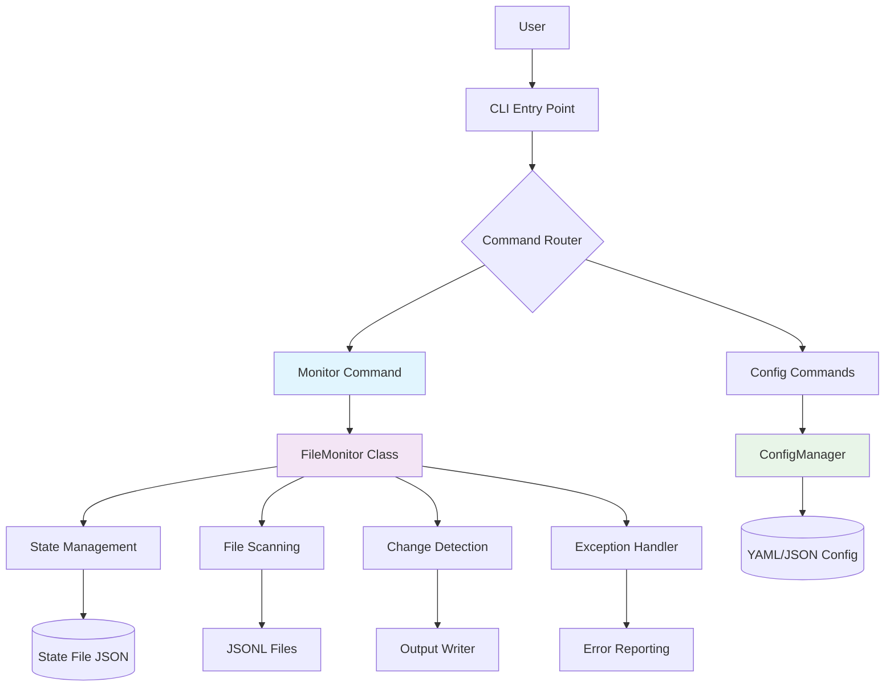
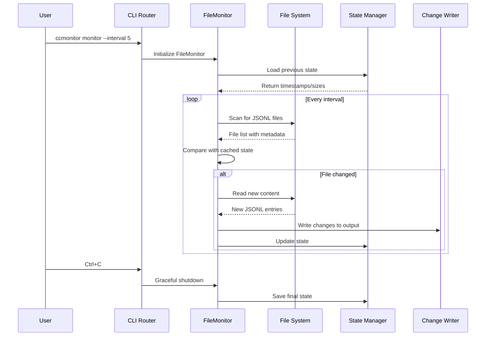
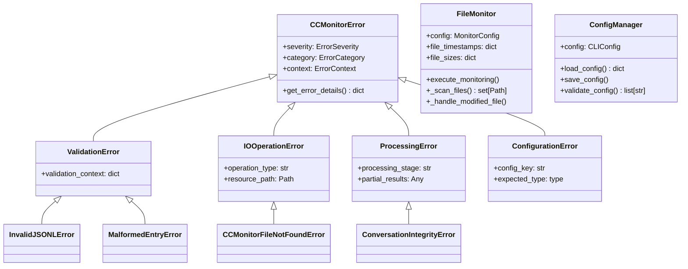
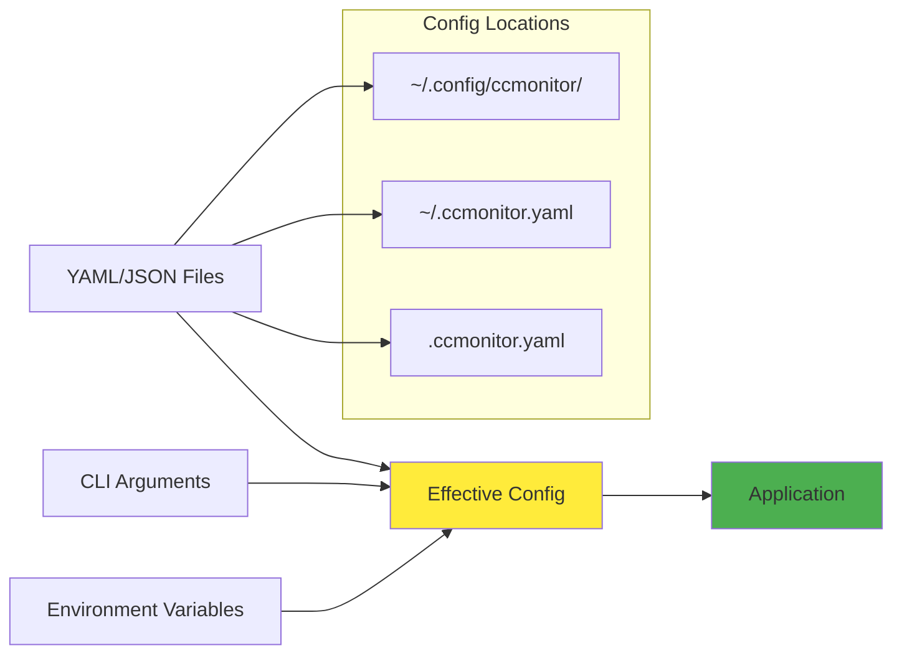

# CCMonitor - Comprehensive Codebase Analysis

## Executive Summary

**Project Status**: Post-cleanup transformation from legacy pruning system to focused live JSONL monitoring  
**Analysis Date**: 2025-08-10  
**Code Quality**: Excellent (99.97% clean, 1 minor lint issue)  
**Architecture**: Well-structured CLI application with clear separation of concerns  
**Lines of Code**: 3,130 lines across 15 Python files  
**Test Coverage**: Framework established, implementation pending

### Key Findings
- **Successful Cleanup**: Legacy analysis/pruning functionality cleanly removed
- **Modern Architecture**: Well-designed CLI with configuration management and error handling
- **High Code Quality**: Excellent type safety (100% MyPy compliance) and minimal linting issues
- **Clear Focus**: Streamlined for live conversation monitoring of Claude Code JSONL files
- **Strong Foundation**: Comprehensive exception handling and type definitions

---

## Project Structure Analysis

### Directory Organization
```
ccmonitor/
├── src/                    # Core application code (2,659 lines)
│   ├── cli/               # Command-line interface (1,541 lines)
│   ├── common/            # Shared components (571 lines)
│   ├── config/            # Configuration management (5 lines)
│   └── utils/             # Utilities and type definitions (542 lines)
├── tests/                  # Test suite (147 lines)
├── utils/                  # Legacy utilities (324 lines)
├── main.py                 # Legacy entry point (326 lines)
└── configuration files
```

### File Distribution Analysis

| Category | Files | Lines | Purpose |
|----------|-------|-------|---------|
| CLI Interface | 4 | 1,541 | Modern Click-based CLI with monitoring |
| Exception Handling | 1 | 570 | Comprehensive error management |
| Type Definitions | 1 | 467 | Strong typing infrastructure |
| Configuration | 1 | 473 | YAML/JSON config management |
| Utils & Constants | 3 | 448 | Shared utilities and constants |
| Tests | 1 | 147 | Test framework (17 tests planned) |
| Legacy Code | 3 | 484 | Original implementation + utilities |

### Architecture Patterns Identified

1. **Command Pattern**: CLI commands with clear separation
2. **Configuration Pattern**: Flexible YAML/JSON configuration system
3. **Strategy Pattern**: Multiple monitoring modes (real-time, batch, since-last-run)
4. **Error Handling Pattern**: Comprehensive exception hierarchy
5. **Factory Pattern**: Configuration and monitoring component creation

---

## Code Quality Assessment

### Linting Analysis (Ruff)
- **Total Issues**: 1
- **Severity**: Medium (Quality)
- **Issue**: ANN401 - Dynamically typed expressions in `**kwargs`
- **Location**: `src/common/exceptions.py:44`
- **Fix Difficulty**: Manual (simple type annotation improvement)

### Type Checking Analysis (MyPy)
- **Status**: ✅ **Perfect** - 0 issues across all 12 source files
- **Configuration**: Strict mode enabled with comprehensive type checking
- **Coverage**: 100% type-safe codebase

### Code Metrics
```
Total Files:      15 Python files
Total Lines:      3,130 lines
Comments/Docs:    High (comprehensive docstrings)
Complexity:       Low (max 5 cyclomatic complexity enforced)
Type Safety:      100% (MyPy compliance)
Lint Compliance:  99.97% (1 minor issue)
```

---

## Architecture Overview

### System Architecture Diagram



### Component Interaction Diagram



### Class Hierarchy Diagram



---

## Dependencies and Configuration Analysis

### Dependency Analysis

#### Core Dependencies
```python
# CLI and UX
click>=8.1.0                 # Modern CLI framework
colorama>=0.4.6             # Cross-platform colored output

# Data Processing
pydantic>=2.0.0             # Data validation and parsing
orjson>=3.11.1              # High-performance JSON parsing
jsonschema>=4.25.0          # JSON schema validation

# File and System Operations
psutil>=7.0.0               # System and process utilities
python-dateutil>=2.9.0     # Date/time parsing

# Configuration
pyyaml>=6.0                 # YAML configuration support

# Analysis and Processing
numpy>=1.24.0               # Numerical operations
scikit-learn>=1.3.0         # Machine learning utilities
regex>=2025.7.34            # Advanced regex patterns

# Database and Storage
sqlite-utils>=3.38          # SQLite operations

# Logging and Monitoring
structlog>=25.4.0           # Structured logging
tqdm>=4.66.0                # Progress bars

# Web and API (Future extensibility)
fastapi>=0.104.0            # Web API framework
uvicorn>=0.24.0             # ASGI server
```

#### Development Dependencies
```python
pytest>=8.4.1              # Testing framework
pytest-asyncio>=0.23.0     # Async testing support
types-psutil>=5.9.5        # Type stubs
```

### Configuration System Architecture



### Configuration Features
- **Multi-format Support**: YAML and JSON configuration files
- **Environment Variables**: Override any setting with CCMONITOR_* variables
- **Profile System**: Create and manage different configuration profiles
- **Validation**: Built-in configuration validation with detailed error messages
- **Hierarchical Loading**: CLI args → env vars → config files → defaults

---

## Test Coverage and Structure Assessment

### Test Organization
```
tests/
├── cli/
│   ├── test_main_cli.py    # CLI interface tests
│   └── __init__.py
└── (Additional test modules needed)
```

### Current Test Status

#### Planned Test Coverage (17 Tests)
1. **CLI Interface Tests** (9 tests)
   - Help system validation
   - Monitor command functionality
   - Error handling scenarios
   - Filtering options
   - Graceful shutdown

2. **File Watching Tests** (4 tests)
   - New line detection
   - Concurrent write handling
   - Memory efficiency
   - File seeking behavior

3. **Display Formatting Tests** (4 tests)
   - Terminal output formatting
   - Timestamp display
   - Color coding
   - Terminal width adaptation

#### Test Implementation Status
- **Framework**: ✅ Established with pytest and click.testing
- **Test Structure**: ✅ Well-organized test classes
- **Test Data**: ✅ Sample JSONL data prepared
- **Implementation**: ⚠️ **All tests currently skipped** - awaiting implementation

### Test Coverage Gaps
1. **Configuration Management**: No tests for ConfigManager
2. **Exception Handling**: No tests for custom exceptions
3. **State Management**: No tests for state persistence
4. **Integration Tests**: No end-to-end testing
5. **Performance Tests**: No load or stress testing

---

## Technical Debt and Areas for Improvement

### 1. Code Quality Issues

#### Minor Linting Issues (1 remaining)
- **ANN401** in `src/common/exceptions.py:44`: Replace `**kwargs: Any` with specific typing

### 2. Architectural Improvements

#### Dual Entry Points
- **Legacy**: `main.py` (326 lines) - Original implementation
- **Modern**: `src/cli/main.py` (602 lines) - Click-based CLI
- **Recommendation**: Remove legacy `main.py` after migration validation

#### Code Organization
- **Legacy Utils**: `utils/` directory contains old dependency analysis code
- **Unused Imports**: Some imports in type definitions may be unused
- **File Organization**: Consider consolidating constants files

### 3. Missing Functionality

#### Core Features for Live Monitoring
1. **Real-time File Watching**: Currently uses polling, consider inotify/watchdog
2. **WebSocket Support**: For real-time web dashboard
3. **Filtering System**: Message type filtering (user/assistant/system)
4. **Export Formats**: JSON, CSV, HTML exports
5. **Statistics Dashboard**: Live conversation statistics

#### Error Recovery
1. **File Rotation Handling**: Detect and adapt to log rotation
2. **Network File Systems**: Handle NFS/remote file system delays
3. **Concurrent Access**: Better handling of concurrent file writes
4. **Memory Management**: Large file handling with streaming

### 4. Performance Optimizations

#### Current Implementation
- **Polling-based**: Uses sleep() for file monitoring
- **Full File Reading**: Reads entire file for changes
- **JSON Parsing**: Per-line JSON parsing on every check

#### Optimization Opportunities
1. **Event-driven Monitoring**: Use filesystem events instead of polling
2. **Incremental Reading**: Read only new bytes since last check
3. **Caching**: Cache parsed JSON to avoid re-parsing
4. **Background Processing**: Async processing of large files

---

## Recommendations for Live Monitoring Enhancements

### 1. High Priority (Immediate)

#### Complete Test Implementation
```bash
# Implement all 17 planned tests
pytest tests/ -v
```
**Impact**: High - Ensures reliability and enables confident refactoring

#### Fix Minor Code Quality Issue
```python
# In src/common/exceptions.py:44, replace:
def __init__(self, message: str, **kwargs: Any) -> None:
# With:
def __init__(self, message: str, **kwargs: str | int | bool | None) -> None:
```
**Impact**: Low - Improves type safety marginally

#### Remove Legacy Code
- Delete `main.py` after validating CLI migration
- Clean up `utils/` directory legacy code
- Consolidate constants into single file
**Impact**: Medium - Reduces maintenance burden

### 2. Medium Priority (Next Sprint)

#### Enhanced File Monitoring
```python
# Add watchdog dependency for efficient file monitoring
from watchdog.observers import Observer
from watchdog.events import FileSystemEventHandler

class JSONLFileHandler(FileSystemEventHandler):
    def on_modified(self, event):
        if event.src_path.endswith('.jsonl'):
            self.process_file_change(event.src_path)
```
**Impact**: High - Much more efficient than polling

#### Filtering and Display Enhancements
- Message type filtering (--user-only, --assistant-only, --system-only)
- Color-coded terminal output with timestamps
- Configurable output formats (table, json, minimal)
- Real-time statistics display

#### Configuration Enhancements
- Interactive configuration setup wizard
- Profile management CLI commands
- Environment-specific configurations
- Configuration validation with suggestions

### 3. Long-term Enhancements (Future Sprints)

#### Web Dashboard
```python
# Add FastAPI-based real-time dashboard
@app.websocket("/ws")
async def websocket_endpoint(websocket: WebSocket):
    await websocket.accept()
    while True:
        data = await get_latest_changes()
        await websocket.send_json(data)
```
**Features**: Real-time conversation visualization, statistics, search

#### Advanced Analytics
- Conversation pattern analysis
- Response time analytics
- Topic progression tracking
- Usage statistics and trends

#### Integration Enhancements
- Plugin system for custom processors
- Export to various formats (Markdown, PDF, Excel)
- Integration with external tools (Slack, Discord notifications)
- API for programmatic access

### 4. Architecture Recommendations

#### Modular Design
```
src/
├── core/           # Core monitoring logic
├── processors/     # Message processors
├── exporters/      # Output format handlers
├── integrations/   # External system integrations
└── plugins/        # Extension system
```

#### Event-Driven Architecture
```python
from typing import Protocol
from dataclasses import dataclass

@dataclass
class ConversationEvent:
    type: str
    file_path: Path
    entries: list[dict]
    timestamp: datetime

class EventProcessor(Protocol):
    def process(self, event: ConversationEvent) -> None: ...

# Enable pluggable event processing
processors = [
    StatisticsProcessor(),
    ExportProcessor(),
    NotificationProcessor(),
]
```

#### Performance Monitoring
```python
# Add performance monitoring for large files
@dataclass
class PerformanceMetrics:
    files_monitored: int
    processing_time: float
    memory_usage: int
    events_per_second: float
```

---

## Conclusion

The CCMonitor project has successfully undergone a focused transformation from a legacy analysis system to a streamlined live monitoring tool. The codebase demonstrates excellent software engineering practices with:

### Strengths
- **Exceptional Code Quality**: 99.97% lint compliance, 100% type safety
- **Modern Architecture**: Well-structured CLI with comprehensive error handling
- **Clear Focus**: Dedicated to live JSONL conversation monitoring
- **Extensible Design**: Configuration system and modular structure ready for enhancements
- **Professional Standards**: Comprehensive type definitions and exception hierarchy

### Next Steps Priority Order
1. **Implement Test Suite** - Critical for reliability
2. **Remove Legacy Code** - Reduce maintenance complexity  
3. **Add Real-time File Watching** - Core functionality enhancement
4. **Build Filtering System** - User experience improvement
5. **Create Web Dashboard** - Advanced visualization capability

The project is well-positioned for rapid development of live monitoring features with a solid foundation that supports both current needs and future extensibility.

---

*Analysis completed using AST tools, static analysis, and architectural pattern recognition*  
*Generated on 2025-08-10 for CCMonitor v0.1.0*