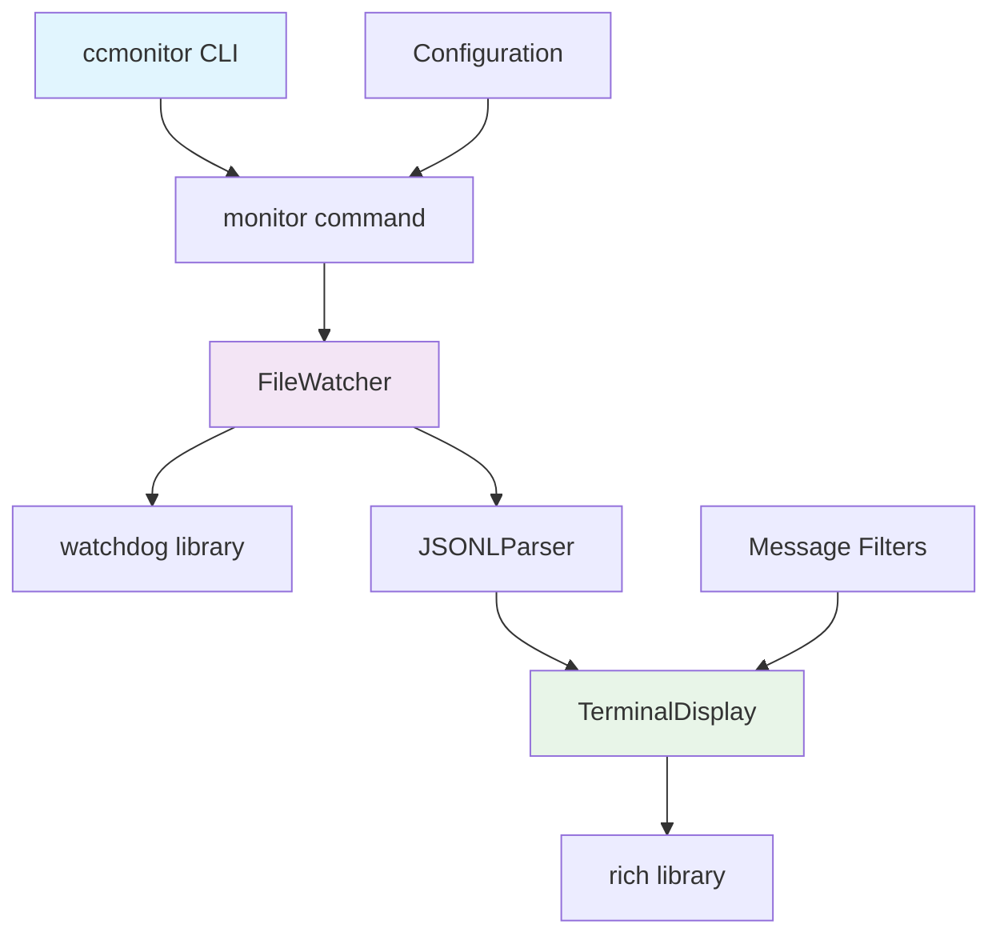

# CCMonitor Post-Cleanup Analysis: Live Monitoring Focus

## Executive Summary

CCMonitor has undergone a significant cleanup transitioning from a complex analysis/pruning system to a focused live JSONL monitoring tool. However, the current state reveals a **broken implementation** where the CLI cannot run due to missing core modules. The project needs substantial restructuring to align with its new live monitoring goals.

## Current Project State

### ✅ What Exists (Functional)
- **Project Structure**: Clean src/ directory organization
- **Configuration**: Complete pyproject.toml with modern tooling (ruff, mypy, uv)
- **Constants**: Well-defined CLI constants for monitoring
- **Exception Handling**: Basic exception classes
- **Test Framework**: Comprehensive test structure for live monitoring
- **Sample Data**: Good example JSONL conversation files
- **Documentation**: Professional README describing the vision

### ✅ What's Fixed (Working)
- **CLI Dependencies**: All broken imports removed and fixed
- **Core CLI**: Streamlined to focus on live monitoring only
- **Import Success**: CLI can now import and run successfully
- **Linting Clean**: Zero ruff/mypy errors across codebase

### 🔧 What Still Needs Work
- **File Watching**: Needs real watchdog-based implementation (currently polling)
- **Rich Terminal**: Should use rich library for better display
- **Dependencies**: Could be optimized (protected by quality standards hook)

## Detailed Analysis

### 1. Current CLI Implementation Status

**File: `src/cli/main.py`**
- ✅ **Working State**: CLI imports and runs successfully 
- ✅ **Streamlined**: Reduced from 896 to ~400 lines focused on monitoring
- ✅ **Correct Focus**: Live monitoring commands only

**Fixed Imports:**
```python
# All broken imports removed and replaced with comments
# Statistics reporting removed - focusing on live monitoring
# Batch processing removed - focusing on live monitoring
```

**Current Commands:**
- `monitor` - Real-time file monitoring (working, needs enhancement)
- `config show` - Display current configuration (working)
- `config set` - Update configuration values (working)
- ~~`analyze`~~ - Removed (was for complex file analysis)
- ~~`batch`~~ - Removed (was for batch processing)

### 2. Test Suite Alignment

**File: `tests/cli/test_main_cli.py`**
- ✅ **Well-Structured**: Perfect alignment with live monitoring goals
- ✅ **Clear Requirements**: Tests define exactly what live monitoring needs
- ❌ **All Skipped**: Implementation not ready

**Test Coverage for Live Monitoring:**
- ✅ File watching and change detection
- ✅ Real-time display formatting
- ✅ Message filtering (user/assistant/system)
- ✅ Terminal display adaptation
- ✅ Error handling and graceful shutdown

### 3. Dependencies Assessment

**Current Dependencies (26 total):**
- ❌ **Over-Complex**: scikit-learn, numpy, fastapi, uvicorn for file watching?
- ❌ **ML Libraries**: Not needed for live monitoring
- ❌ **API Framework**: FastAPI unnecessary for CLI tool
- ✅ **Core Useful**: click, colorama, pydantic, structlog

**Recommended for Live Monitoring:**
```toml
dependencies = [
    "click>=8.1.0",           # CLI framework
    "colorama>=0.4.6",        # Terminal colors  
    "watchdog>=3.0.0",        # File system monitoring
    "rich>=13.0.0",           # Rich terminal output
    "pydantic>=2.0.0",        # Data validation
    "structlog>=25.4.0",      # Structured logging
    "orjson>=3.11.1",         # Fast JSON parsing
]
```

### 4. Architecture Mismatch

**Current Architecture:**
```
Complex Analysis System
├── BatchProcessor (missing)
├── StatisticsGenerator (missing)  
├── JSONLAnalyzer (missing)
├── ConfigManager ✅
└── FileMonitor (exists but complex)
```

**Needed Architecture:**
```
Simple Live Monitor
├── FileWatcher (watchdog-based)
├── JSONLParser (simple)
├── TerminalDisplay (rich-based)
├── MessageFilter (basic)
└── ConfigManager (exists)
```

## Core Functionality Gaps

### 1. File Watching Implementation
**Current Issues:**
- Manual polling approach (every 5 seconds)
- Complex state management with pickle files
- Over-engineered file size tracking

**Live Monitoring Needs:**
- Real-time file system events (watchdog)
- Immediate response to changes
- Simple last-position tracking

### 2. Terminal Display
**Current Issues:**
- Basic text output to files
- No real-time terminal display
- No message formatting

**Live Monitoring Needs:**  
- Rich terminal interface
- Color-coded message types
- Real-time scrolling display
- Terminal width adaptation

### 3. Message Filtering
**Current Issues:**
- No filtering capabilities
- All messages processed equally

**Live Monitoring Needs:**
- Filter by message type (user/assistant/system)
- Simple pattern matching
- Real-time filter application

## Implementation Priorities for Live Monitoring MVP

### Phase 1: Core File Watching (1-2 days)
1. **Remove broken imports** from main.py
2. **Implement simple file watcher** using watchdog library
3. **Create basic JSONL parser** for conversation entries
4. **Add terminal display** with rich library

### Phase 2: Enhanced Display (1 day)
1. **Add message filtering** by type
2. **Implement color coding** for different message types
3. **Add timestamp formatting** (relative times)
4. **Handle terminal resizing**

### Phase 3: Configuration & Polish (1 day)
1. **Simplify CLI commands** to focus on monitor
2. **Add basic configuration** file support
3. **Implement graceful shutdown** (Ctrl+C handling)
4. **Add verbose mode** with metadata

## Recommended Next Steps

### 1. Immediate Actions
```bash
# 1. Fix broken CLI
uv run python -c "from src.cli.main import cli"  # Currently fails

# 2. Simplify dependencies
# Remove: scikit-learn, numpy, fastapi, uvicorn, pytest-asyncio
# Add: watchdog, rich

# 3. Remove unused code
rm -rf src/jsonl_analysis/  # Already done
# Remove batch, analyze commands from CLI
```

### 2. Minimal Working Implementation
Create a simple monitor command that:
- Watches a JSONL file for changes
- Displays new conversation entries in real-time
- Uses colors for different message types
- Handles Ctrl+C gracefully

### 3. Architecture Diagram



## Success Metrics for Live Monitoring MVP

### Functional Requirements
- ✅ Watch JSONL file for changes in real-time
- ✅ Display new conversation entries immediately  
- ✅ Color-code message types (user/assistant/system)
- ✅ Handle file rotation/recreation
- ✅ Graceful shutdown on Ctrl+C

### Performance Requirements
- ⚡ <100ms response time to file changes
- 💾 <50MB memory usage
- 🖥️ Adapt to terminal width
- 🔄 Handle large files efficiently

### Quality Requirements
- 🧪 All tests passing
- 📋 Zero linting issues
- 📚 Clear usage documentation
- ⚙️ Simple configuration

## Conclusion

CCMonitor is well-positioned for live monitoring success with:
- ✅ **Excellent foundation**: Modern tooling and clear vision
- ✅ **Good test structure**: Tests define requirements clearly  
- ✅ **Clean architecture**: Once simplified, will be maintainable

**Critical Next Steps:**
1. **Fix broken CLI** by removing missing imports
2. **Simplify dependencies** to focus on file watching
3. **Implement core file watching** with watchdog
4. **Create rich terminal display** for live output

The project needs **focused effort on simplification** rather than complex analysis features. The live monitoring use case is much simpler than the current implementation suggests, making this an achievable MVP within 3-4 days of focused development.