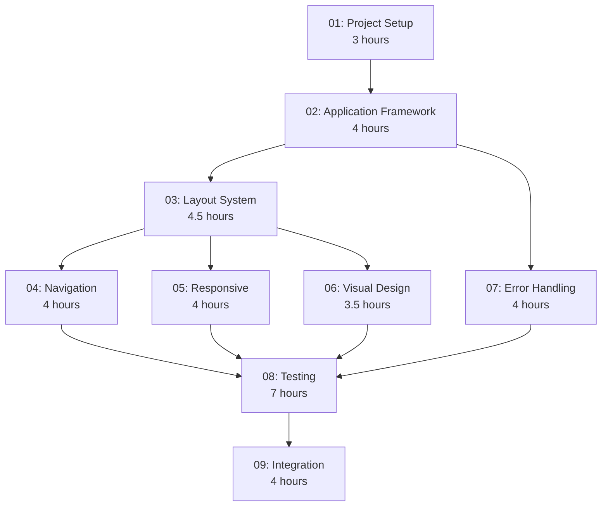

# TUI Foundation Implementation Order

## Overview
This document outlines the optimal implementation order for the TUI Foundation PRPs, considering dependencies, parallel development opportunities, and risk mitigation.

## Total Estimated Effort
**Phase 1 (TUI Foundation)**: 16 hours (2 days)
- Day 1: 8 hours (PRPs 01-04)
- Day 2: 8 hours (PRPs 05-09)

## Implementation Phases

### Phase 1: Foundation Setup (3 hours)
**Sequential - Must be completed first**

#### PRP 01: Project Setup and Structure
- **Duration**: 3 hours
- **Dependencies**: None
- **Critical Path**: Yes
- **Why First**: Creates the package structure needed by all other PRPs

**Deliverables**:
- Complete `src/tui/` package structure
- Dependencies cleaned up
- CSS system configured
- Base exceptions defined

---

### Phase 2: Core Framework (4 hours)
**Sequential - Requires Phase 1**

#### PRP 02: Application Framework
- **Duration**: 4 hours
- **Dependencies**: PRP 01
- **Critical Path**: Yes
- **Why Second**: Central orchestrator needed for all UI components

**Deliverables**:
- CCMonitorApp class
- Screen management system
- Global key bindings
- Application lifecycle

---

### Phase 3: UI Components (8.5 hours)
**Can be parallelized after Phase 2**

#### Parallel Track A: Layout and Navigation

##### PRP 03: Layout System
- **Duration**: 4.5 hours
- **Dependencies**: PRPs 01, 02
- **Can Start**: After PRP 02
- **Parallel With**: PRP 05

**Deliverables**:
- Three-panel layout
- Header and Footer widgets
- Projects and LiveFeed panels

##### PRP 04: Navigation and Interaction
- **Duration**: 4 hours
- **Dependencies**: PRPs 01, 02, 03
- **Can Start**: After PRP 03 (needs layout)
- **Parallel With**: PRP 06

**Deliverables**:
- Focus management
- Keyboard navigation
- Help overlay
- Context navigation

#### Parallel Track B: Responsive and Visual

##### PRP 05: Responsive Terminal Handling
- **Duration**: 4 hours
- **Dependencies**: PRPs 01, 02, 03
- **Can Start**: After PRP 03
- **Parallel With**: PRP 04

**Deliverables**:
- Resize handling
- Terminal capability detection
- Adaptive layouts
- Fallback modes

##### PRP 06: Visual Design and Theming
- **Duration**: 3.5 hours
- **Dependencies**: PRPs 01, 02, 03
- **Can Start**: After PRP 03
- **Parallel With**: PRP 04

**Deliverables**:
- Theme system
- Message styling
- Loading indicators
- Transitions

---

### Phase 4: Quality and Integration (11.5 hours)
**Sequential - After UI components**

#### PRP 07: Error Handling and Compatibility
- **Duration**: 4 hours
- **Dependencies**: PRPs 01, 02
- **Can Start**: After PRP 02
- **Parallel With**: UI development

**Deliverables**:
- Error handling system
- Startup validation
- Fallback modes
- Recovery mechanisms

#### PRP 08: Testing and Quality Assurance
- **Duration**: 7 hours
- **Dependencies**: All previous PRPs
- **Can Start**: After Phase 3 complete
- **Why Later**: Needs complete implementation to test

**Deliverables**:
- Test infrastructure
- >95% test coverage
- Performance benchmarks
- Cross-platform validation

#### PRP 09: Integration and CLI Compatibility
- **Duration**: 4 hours
- **Dependencies**: All TUI PRPs
- **Can Start**: After PRP 08
- **Why Last**: Final integration step

**Deliverables**:
- CLI/TUI integration
- Mode selection
- Configuration sharing
- Documentation

---

## Optimal Development Schedule

### Day 1 (8 hours)
```
Morning (4 hours):
  09:00-12:00: PRP 01 - Project Setup (3h)
  12:00-13:00: PRP 02 - Start Application Framework (1h)
  
Afternoon (4 hours):
  14:00-17:00: PRP 02 - Complete Application Framework (3h)
  17:00-18:00: PRP 03 - Start Layout System (1h)
```

### Day 2 (8 hours)
```
Morning (4 hours):
  09:00-12:00: PRP 03 - Complete Layout System (3.5h)
  12:00-13:00: Start parallel work:
    - Developer A: PRP 04 - Navigation (0.5h)
    - Developer B: PRP 05 - Responsive (0.5h)

Afternoon (4 hours):
  14:00-16:00: Continue parallel:
    - Developer A: PRP 04 - Navigation (2h)
    - Developer B: PRP 06 - Visual Design (2h)
  16:00-18:00: 
    - PRP 07 - Error Handling (2h)
```

### Day 3 (if needed for testing/polish)
```
Morning (4 hours):
  09:00-13:00: PRP 08 - Testing (4h)

Afternoon (4 hours):
  14:00-18:00: PRP 09 - Integration (4h)
```

---

## Dependency Graph



---

## Parallel Development Opportunities

### Can Be Done in Parallel:
1. **After PRP 03**:
   - PRP 04 (Navigation) 
   - PRP 05 (Responsive)
   - PRP 06 (Visual Design)

2. **After PRP 02**:
   - PRP 07 (Error Handling) - Can start early as it's mostly independent

### Must Be Sequential:
1. PRP 01 → PRP 02 → PRP 03 (Foundation chain)
2. PRP 08 → PRP 09 (Testing before integration)

---

## Risk Mitigation Strategy

### High-Risk Items (Do First):
1. **Terminal Compatibility** (PRP 05) - Platform-specific issues
2. **Performance** (PRP 08) - May require architecture changes
3. **Error Handling** (PRP 07) - Critical for user experience

### Low-Risk Items (Can Defer):
1. **Visual Polish** (PRP 06) - Can iterate later
2. **Advanced Navigation** (PRP 04) - Basic navigation sufficient initially

---

## Quality Gates

### After Each PRP:
- [ ] Code passes linting (`uv run ruff check`)
- [ ] Type checking passes (`uv run mypy`)
- [ ] Unit tests pass
- [ ] Manual smoke test successful

### After Phase 3:
- [ ] Integration tests pass
- [ ] Performance benchmarks met
- [ ] Cross-platform testing complete

### Before Production:
- [ ] >95% test coverage
- [ ] Documentation complete
- [ ] All PRPs validated
- [ ] User acceptance testing

---

## Alternative Schedules

### Single Developer (Sequential)
- **Duration**: 3-4 days
- **Order**: PRP 01 → 02 → 03 → 04 → 05 → 06 → 07 → 08 → 09

### Two Developers (Parallel)
- **Duration**: 2 days
- **Split After PRP 03**:
  - Dev A: PRP 04, 07, 08 (testing)
  - Dev B: PRP 05, 06, 09 (integration)

### Fast Track (MVP)
- **Duration**: 1 day
- **Essential Only**: PRP 01 → 02 → 03 → 07 → 09
- **Defer**: PRPs 04, 05, 06, 08 (add later)

---

## Success Metrics

### Day 1 Complete:
- [ ] TUI application launches
- [ ] Basic three-panel layout visible
- [ ] Can quit with 'q' key

### Day 2 Complete:
- [ ] Full navigation working
- [ ] Responsive to terminal resize
- [ ] Visual design applied
- [ ] Error handling functional

### Phase Complete:
- [ ] All acceptance criteria met
- [ ] Tests passing with >95% coverage
- [ ] Integrated with CLI
- [ ] Ready for multi-project monitoring features

---

## Notes for Implementation

1. **Start Simple**: Get basic TUI running first, then enhance
2. **Test Early**: Write tests as you implement, not after
3. **Document Gotchas**: Keep track of platform-specific issues
4. **Regular Integration**: Merge PRPs frequently to avoid conflicts
5. **User Feedback**: Show progress to stakeholders after Phase 3

This implementation order ensures a logical progression from foundation to polish, with opportunities for parallel development to accelerate delivery.