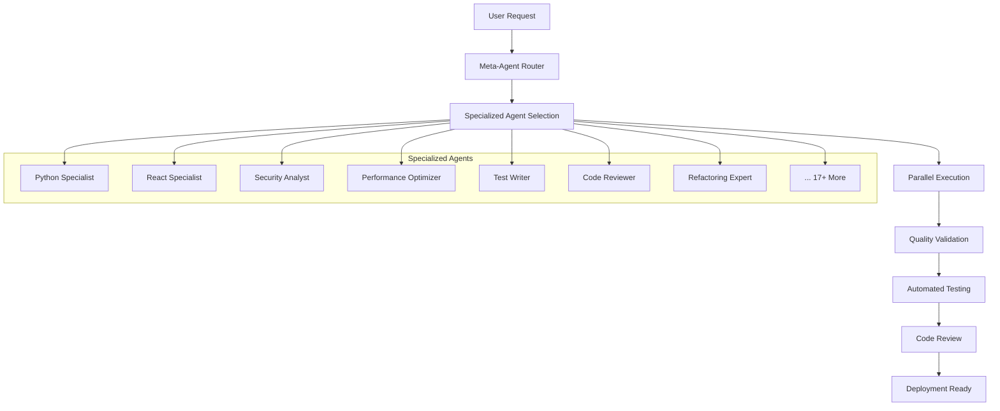
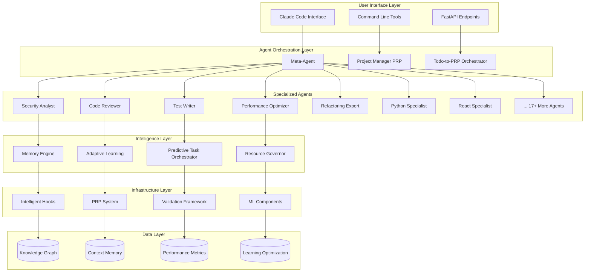
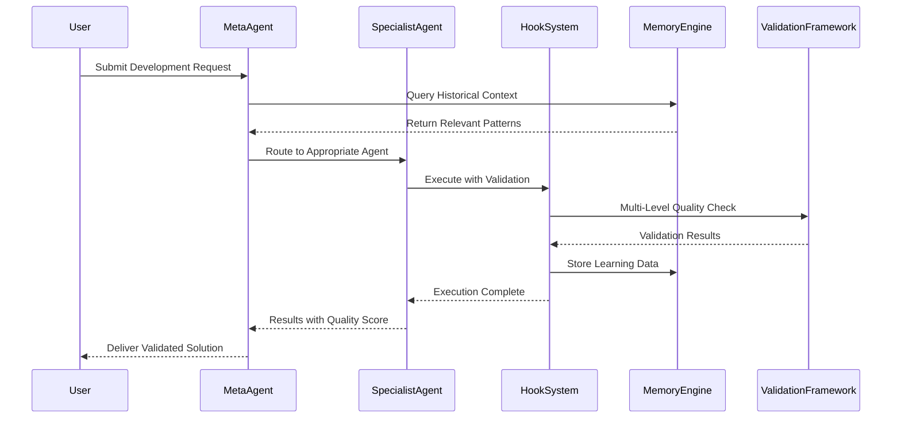
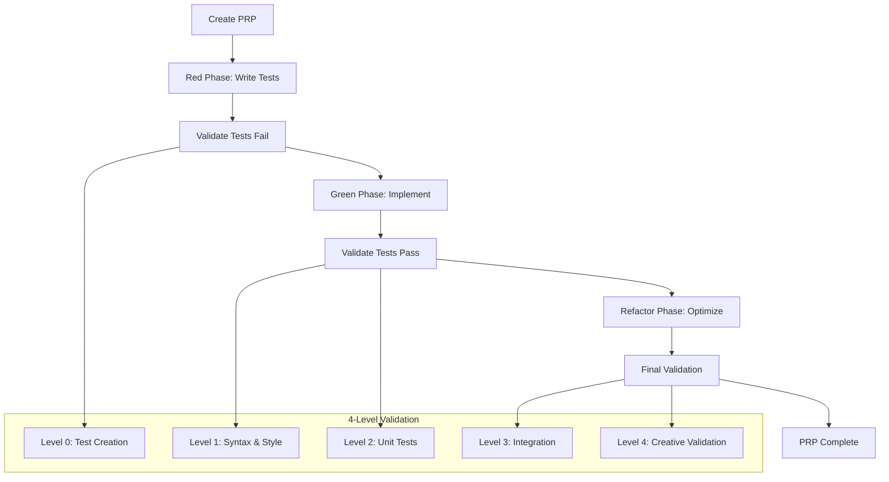
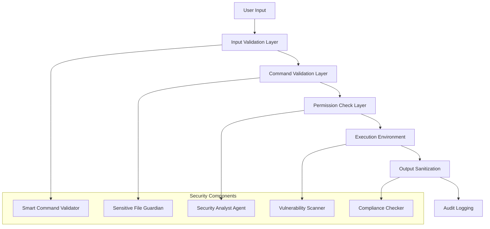

# Claude Agents: Next-Generation AI Development Environment

[](https://python.org)
[](https://fastapi.tiangolo.com)
[](https://pytest.org)
[](https://github.com/psf/black)
[](LICENSE)
[](https://github.com)

**The world's first autonomous Test-Driven Development environment powered by specialized AI agents and machine learning-enhanced workflow optimization.**

## Table of Contents

- [Overview](#overview)
- [Key Features](#key-features)
- [Quick Start](#quick-start)
- [Architecture](#architecture)
- [Specialized Agents](#specialized-agents)
- [Intelligent Hooks System](#intelligent-hooks-system)
- [PRP System](#prp-system-project-requirement-planning)
- [Installation](#installation)
- [Configuration](#configuration)
- [Usage Examples](#usage-examples)
- [Testing Framework](#testing-framework)
- [Security Features](#security-features)
- [Machine Learning Components](#machine-learning-components)
- [Contributing](#contributing)
- [FAQ](#faq)
- [Roadmap](#roadmap)
- [License](#license)

## Overview

Claude Agents represents a paradigm shift in software development, combining the power of Test-Driven Development (TDD) with autonomous AI agents and machine learning-enhanced workflows. This system implements a "context is non-negotiable" philosophy, enabling true autonomous development without human clarification loops.

### What Makes Claude Agents Revolutionary?

- **24+ Specialized AI Agents** that handle every aspect of development
- **TDD-First PRP System** (Project Requirement Planning) with 4-level validation loops
- **12+ Intelligent Hooks** providing persistent memory, predictive optimization, and security enforcement
- **Machine Learning Components** that learn from development patterns and optimize workflows
- **Zero-Regression Architecture** with comprehensive quality gates
- **Autonomous Development Capabilities** with deterministic control points

## Key Features

### 🤖 Autonomous Agent Orchestration



### 🧠 Intelligent Memory & Learning System

- **Context Memory Engine**: Maintains persistent knowledge graphs across sessions
- **Adaptive Error Learning**: Learns from errors and suggests previously successful solutions
- **Pattern Recognition**: Identifies development patterns and optimizes workflows
- **Predictive Task Orchestration**: Anticipates next steps and pre-fetches resources

### 🛡️ Security & Quality Enforcement

- **Smart Command Validator**: Prevents dangerous operations before execution
- **Sensitive File Guardian**: Protects critical configuration and credential files
- **Auto Code Review**: Automated security and quality analysis
- **Test-Driven Development Assistant**: Enforces TDD methodology with comprehensive coverage

### 📊 Advanced Analytics & Optimization

- **Resource Governor**: Optimizes API token usage and suggests efficient alternatives
- **Performance Monitoring**: Real-time system performance tracking
- **Quality Metrics**: Comprehensive code quality and technical debt analysis
- **Learning Analytics**: Continuous improvement through ML-powered insights

## Quick Start

### Prerequisites

- Python 3.11+
- UV package manager
- Git
- Claude Code CLI (with advanced hooks enabled)

### Installation

```bash
# Clone the repository
git clone https://github.com/yourusername/claude-agents.git
cd claude-agents

# Install dependencies using UV
uv sync

# Initialize the PRP infrastructure
uv run python PRPs/scripts/prp_creator.py --init

# Verify installation
uv run python -m pytest tests/ -v
```

### First Run

```bash
# Start the development environment
uv run python main.py

# Create your first PRP (Project Requirement Prompt)
uv run python PRPs/scripts/prp_creator.py --template tdd_base --name "my-first-feature"

# Execute the PRP with TDD validation
uv run python PRPs/scripts/prp_runner.py --prp PRPs/active/my-first-feature.md
```

## Architecture

### System Architecture Overview



### Data Flow Architecture



## Specialized Agents

The Claude Agents system includes 24+ specialized AI agents, each expert in specific domains:

### Core Development Agents

| Agent | Specialization | Key Features |
|-------|---------------|--------------|
| **python-specialist** | Python development | FastAPI, Django, pytest, performance optimization |
| **javascript-typescript-specialist** | JS/TS development | React, Node.js, TypeScript, modern frameworks |
| **react-specialist** | React applications | Hooks, state management, performance, testing |
| **nextjs-specialist** | Next.js applications | SSR, SSG, API routes, deployment |
| **vue-specialist** | Vue.js applications | Composition API, Nuxt, testing, performance |

### Infrastructure & DevOps Agents

| Agent | Specialization | Key Features |
|-------|---------------|--------------|
| **docker-kubernetes-specialist** | Containerization | Docker optimization, K8s deployment, security |
| **aws-specialist** | AWS cloud services | Architecture, cost optimization, best practices |
| **postgresql-specialist** | PostgreSQL databases | Query optimization, schema design, performance |
| **mongodb-specialist** | MongoDB databases | NoSQL design, aggregation, scaling |

### Quality Assurance Agents

| Agent | Specialization | Key Features |
|-------|---------------|--------------|
| **code-reviewer** | Code quality analysis | Security, performance, maintainability |
| **test-writer** | Test automation | Unit, integration, E2E testing |
| **security-analyst** | Security auditing | OWASP compliance, vulnerability scanning |
| **performance-optimizer** | Performance tuning | Bottleneck identification, optimization |
| **refactoring-expert** | Code improvement | Clean code principles, technical debt reduction |

### Specialized Domain Agents

| Agent | Specialization | Key Features |
|-------|---------------|--------------|
| **api-design-specialist** | API development | RESTful design, OpenAPI, versioning |
| **machine-learning-specialist** | ML/AI development | Model training, deployment, MLOps |
| **blockchain-specialist** | Blockchain development | Smart contracts, DeFi, security |
| **cypress-testing-specialist** | E2E testing | Cypress automation, test strategies |

### Meta-Coordination Agents

| Agent | Specialization | Key Features |
|-------|---------------|--------------|
| **meta-agent** | Agent coordination | Task routing, parallel execution |
| **project-manager-prp** | Project management | PRP creation, dependency analysis |
| **todo-to-prp-orchestrator** | Task orchestration | Todo parsing, PRP generation |
| **context-pruner** | Context management | Intelligent pruning, relevance scoring |

## Intelligent Hooks System

The Claude Agents environment includes 12+ intelligent hooks that provide advanced automation and safety features:

### Memory & Learning Hooks

```python
# Context Memory Engine
class ContextMemoryEngine:
    """Maintains persistent knowledge graph across sessions"""
    
    def track_file_relationships(self, file_path: str) -> Dict[str, Any]:
        """Tracks file dependencies and usage patterns"""
        
    def suggest_related_files(self, current_files: List[str]) -> List[str]:
        """Suggests related files based on usage patterns"""
        
    def learn_from_session(self, session_data: Dict) -> None:
        """Updates knowledge graph with session learnings"""
```

### Workflow Optimization Hooks

```python
# Predictive Task Orchestrator
class PredictiveTaskOrchestrator:
    """Optimizes task workflows and predicts next steps"""
    
    def predict_next_tasks(self, current_context: Dict) -> List[Task]:
        """Predicts likely next tasks based on patterns"""
        
    def identify_parallel_opportunities(self, tasks: List[Task]) -> List[List[Task]]:
        """Identifies tasks that can be executed in parallel"""
        
    def prefetch_resources(self, predicted_tasks: List[Task]) -> None:
        """Pre-fetches files and resources for predicted tasks"""
```

### Safety & Quality Hooks

```python
# Smart Command Validator
class SmartCommandValidator:
    """Prevents dangerous operations and promotes safety"""
    
    DANGEROUS_PATTERNS = [
        r'rm\s+-rf\s+/',
        r':\(\)\{.*\};\:',  # Fork bombs
        r'sudo\s+rm',       # Dangerous sudo operations
    ]
    
    def validate_command(self, command: str) -> ValidationResult:
        """Validates command safety before execution"""
```

## PRP System (Project Requirement Planning)

The PRP system revolutionizes development by combining traditional project requirements with Test-Driven Development methodology.

### PRP Philosophy: "Context is Non-Negotiable"

Traditional Product Requirements Documents (PRDs) often lack the context needed for autonomous development. PRPs solve this by providing:

- **Complete Context**: All necessary information for autonomous execution
- **Test-First Methodology**: TDD enforcement at every level
- **4-Level Validation Loops**: Comprehensive quality assurance
- **Deterministic Outcomes**: Predictable, repeatable results

### PRP Template Structure

```markdown
# PRP-XXX: [Feature Name]

## Goal & Success Criteria
**Feature Goal**: Clear, measurable objective
**Deliverable**: Specific output expected
**Success Definition**: Quantifiable success metrics

## TDD Methodology Section
**Red Phase**: Test specifications that must fail initially
**Green Phase**: Minimal implementation to make tests pass
**Refactor Phase**: Code improvement while maintaining tests

## Test-First Validation Loop
Level 0: Test Creation
- Write failing tests before implementation
- Validate test coverage requirements

Level 1: Syntax & Style (Red Phase)
- Linting and type checking
- Code style validation

Level 2: Unit Tests (Green Phase)
- Make failing tests pass
- Achieve required coverage

Level 3: Integration Testing (Green Phase)
- End-to-end validation
- System integration tests

Level 4: Refactor & Optimize (Refactor Phase)
- Performance optimization
- Code quality improvements
```

### PRP Execution Workflow



## Installation

### System Requirements

- **Operating System**: Linux (Ubuntu 20.04+), macOS (10.15+), Windows (WSL2)
- **Python**: 3.11 or higher
- **Memory**: 8GB RAM minimum (16GB recommended)
- **Storage**: 10GB free space
- **Network**: Internet connection for AI model access

### Detailed Installation Steps

1. **Clone the Repository**
   ```bash
   git clone https://github.com/yourusername/claude-agents.git
   cd claude-agents
   ```

2. **Install UV Package Manager**
   ```bash
   curl -LsSf https://astral.sh/uv/install.sh | sh
   source ~/.bashrc  # or ~/.zshrc
   ```

3. **Set Up Virtual Environment**
   ```bash
   uv sync
   uv run python --version  # Verify Python 3.11+
   ```

4. **Initialize PRP Infrastructure**
   ```bash
   uv run python PRPs/scripts/prp_creator.py --init
   ```

5. **Configure Claude Code Integration**
   ```bash
   # Ensure Claude Code CLI is installed and configured
   claude --version
   
   # Verify hooks are properly loaded
   claude hooks list
   ```

6. **Run Initial Tests**
   ```bash
   uv run pytest tests/ -v --cov=PRPs --cov-report=term-missing
   ```

### Docker Installation (Alternative)

```bash
# Build the Docker image
docker build -t claude-agents .

# Run the container
docker run -it --name claude-agents-dev claude-agents
```

### Development Installation

For contributors and advanced users:

```bash
# Install development dependencies
uv sync --dev

# Install pre-commit hooks
uv run pre-commit install

# Run full test suite including integration tests
uv run pytest tests/ --integration -v
```

## Configuration

### Environment Variables

Create a `.env` file in the project root:

```bash
# Core Configuration
CLAUDE_PROJECT_DIR=/home/user/dev/claude-agents
AUTO_COMMIT=true
TDD_ENFORCEMENT=strict

# Agent Configuration
MAX_PARALLEL_AGENTS=5
AGENT_TIMEOUT=300
CONTEXT_MEMORY_SIZE=10000

# Performance Settings
RESOURCE_GOVERNOR_ENABLED=true
PREDICTIVE_PREFETCH=true
INTELLIGENT_CACHING=true

# Security Settings
SENSITIVE_FILE_PROTECTION=true
COMMAND_VALIDATION=strict
SECURITY_SCANNING=enabled

# ML Components
LEARNING_ENABLED=true
PATTERN_RECOGNITION=true
ADAPTIVE_OPTIMIZATION=true
```

### Agent Configuration

Configure individual agents in `.claude/agents/`:

```yaml
# Example: python-specialist.md configuration
specialist: python
frameworks: [fastapi, django, flask, pytest]
optimization_level: aggressive
security_checks: enabled
test_coverage_minimum: 90
code_style: black
type_checking: mypy
```

### Hook Configuration

Configure hooks in `.claude/settings.json`:

```json
{
  "hooks": {
    "preToolUse": [
      "pre_tool_validator.py",
      "context_memory_engine.py"
    ],
    "postToolUse": [
      "post_tool_logger.py",
      "learning_system.py"
    ],
    "userPromptSubmit": [
      "prompt_enhancer.py",
      "context_injector.py"
    ],
    "preCompact": [
      "intelligent_context_pruner.py"
    ]
  },
  "agent_orchestration": {
    "parallel_execution": true,
    "max_concurrent_agents": 5,
    "timeout_seconds": 300
  }
}
```

## Usage Examples

### Basic Feature Development

```bash
# Create a new feature using TDD methodology
uv run python PRPs/scripts/prp_creator.py \
  --template tdd_base \
  --name "user-authentication" \
  --output PRPs/active/

# Execute the PRP with full validation
uv run python PRPs/scripts/prp_runner.py \
  --prp PRPs/active/user-authentication.md \
  --validate-tdd \
  --parallel-agents
```

### API Development Workflow

```python
# Example: Creating a FastAPI endpoint with full TDD
from PRPs.scripts.prp_creator import PRPCreator

prp = PRPCreator()
prp.create_api_prp(
    name="user-profile-endpoint",
    method="POST",
    endpoint="/api/v1/users/profile",
    authentication_required=True,
    validation_schema="UserProfileSchema",
    test_coverage_minimum=95
)

# This automatically:
# 1. Creates failing tests for the endpoint
# 2. Generates OpenAPI specification
# 3. Implements minimal working code
# 4. Runs security analysis
# 5. Optimizes performance
# 6. Validates integration
```

### Refactoring with Quality Assurance

```bash
# Identify refactoring opportunities
uv run python PRPs/scripts/intelligent_project_analyzer.py \
  --analyze-technical-debt \
  --suggest-improvements

# Create refactoring PRP
uv run python PRPs/scripts/prp_creator.py \
  --template red_green_refactor \
  --target-file src/legacy_module.py \
  --preserve-behavior \
  --zero-regression
```

### Multi-Agent Collaboration

```python
# Example: Complex feature requiring multiple specialists
from PRPs.scripts.multi_agent_orchestrator import MultiAgentOrchestrator

orchestrator = MultiAgentOrchestrator()

# Define a complex task
task = {
    "name": "e-commerce-checkout-flow",
    "requirements": [
        "Frontend: React checkout form with validation",
        "Backend: FastAPI payment processing",
        "Database: PostgreSQL transaction handling",
        "Security: PCI compliance validation",
        "Testing: End-to-end Cypress tests"
    ],
    "parallel_execution": True
}

# Execute with multiple specialists
result = orchestrator.execute_complex_task(task)
# Automatically coordinates:
# - react-specialist for frontend
# - python-specialist for backend
# - postgresql-specialist for database
# - security-analyst for compliance
# - cypress-testing-specialist for E2E tests
```

### Performance Optimization Workflow

```bash
# Analyze performance bottlenecks
uv run python PRPs/scripts/performance_analyzer.py \
  --profile-application \
  --identify-bottlenecks \
  --suggest-optimizations

# Create optimization PRP
uv run python PRPs/scripts/prp_creator.py \
  --template performance_optimization \
  --target-bottlenecks "database_queries,api_response_time" \
  --performance-goals "response_time<100ms,throughput>1000rps"
```

## Testing Framework

### TDD-First Testing Philosophy

The Claude Agents system enforces Test-Driven Development at every level:

```python
# Example: TDD cycle enforcement
class TDDEnforcer:
    def validate_red_phase(self, test_files: List[str]) -> bool:
        """Ensure tests fail before implementation"""
        for test_file in test_files:
            result = self.run_tests(test_file)
            if result.passed:
                raise TDDViolation(f"Tests in {test_file} should fail in Red phase")
        return True
    
    def validate_green_phase(self, test_files: List[str]) -> bool:
        """Ensure tests pass after minimal implementation"""
        for test_file in test_files:
            result = self.run_tests(test_file)
            if not result.passed:
                raise TDDViolation(f"Tests in {test_file} should pass in Green phase")
        return True
```

### 4-Level Validation Framework

```bash
# Level 0: Test Creation Validation
uv run python PRPs/scripts/prp_validator.py --validate-test-creation

# Level 1: Syntax & Style Validation
uv run ruff check . --fix
uv run mypy PRPs/ tests/
uv run black . --check

# Level 2: Unit Test Validation
uv run pytest tests/unit/ -v --cov=PRPs --cov-fail-under=90

# Level 3: Integration Test Validation
uv run pytest tests/integration/ -v --slow

# Level 4: Creative & End-to-End Validation
uv run pytest tests/scenarios/ -v --e2e
```

### Test Categories

| Test Category | Purpose | Location | Coverage Target |
|---------------|---------|----------|-----------------|
| **Unit Tests** | Individual component testing | `tests/unit/` | 95%+ |
| **Integration Tests** | Component interaction testing | `tests/integration/` | 85%+ |
| **Agent Tests** | Specialized agent validation | `tests/agents/` | 90%+ |
| **PRP Tests** | PRP system validation | `tests/prp/` | 95%+ |
| **Performance Tests** | Performance benchmarking | `tests/performance/` | Coverage N/A |
| **Security Tests** | Security vulnerability testing | `tests/security/` | 100% |
| **Scenario Tests** | End-to-end user scenarios | `tests/scenarios/` | User journeys |

### Continuous Testing Integration

```yaml
# .github/workflows/ci.yml
name: Continuous Integration
on: [push, pull_request]

jobs:
  test:
    runs-on: ubuntu-latest
    steps:
      - uses: actions/checkout@v3
      - name: Install UV
        run: curl -LsSf https://astral.sh/uv/install.sh | sh
      - name: Run TDD Validation
        run: |
          uv run python PRPs/scripts/prp_validator.py --validate-all-prps
          uv run pytest tests/ -v --cov=PRPs --cov-fail-under=90
      - name: Security Scan
        run: uv run python PRPs/scripts/security_scanner.py --comprehensive
```

## Security Features

### Multi-Layer Security Architecture



### Security Enforcement Mechanisms

#### 1. Smart Command Validator

```python
class SmartCommandValidator:
    """Prevents execution of dangerous commands"""
    
    BLOCKED_COMMANDS = [
        r'rm\s+-rf\s+/',           # Recursive delete of root
        r':\(\)\{.*\};\:',         # Fork bombs
        r'sudo\s+rm\s+-rf',       # Dangerous sudo operations
        r'chmod\s+777\s+/',        # Overly permissive permissions
        r'wget.*\|\s*bash',        # Dangerous pipe to bash
        r'curl.*\|\s*sh',          # Dangerous pipe to shell
    ]
    
    def validate_command(self, command: str) -> ValidationResult:
        for pattern in self.BLOCKED_COMMANDS:
            if re.search(pattern, command):
                return ValidationResult(
                    valid=False,
                    reason=f"Blocked dangerous command pattern: {pattern}",
                    recommendation="Use safer alternatives"
                )
        return ValidationResult(valid=True)
```

#### 2. Sensitive File Guardian

Protects critical system and configuration files:

```python
PROTECTED_FILES = [
    r'\.env$',                    # Environment files
    r'\.env\..*',                 # Environment variants
    r'id_rsa$',                   # SSH private keys
    r'\.pem$',                    # Certificate files
    r'config\.json$',             # Configuration files
    r'secrets\..*',               # Secret files
    r'/etc/passwd',               # System password file
    r'/etc/shadow',               # Shadow password file
]
```

#### 3. Automated Security Scanning

```bash
# Comprehensive security audit
uv run python PRPs/scripts/security_scanner.py \
  --scan-dependencies \
  --check-vulnerabilities \
  --audit-permissions \
  --validate-configurations
```

### Compliance & Standards

- **OWASP Top 10**: Automated checking for common web vulnerabilities
- **PCI DSS**: Payment card industry compliance validation
- **SOC 2**: Security controls for service organizations
- **GDPR**: Data protection and privacy compliance
- **ISO 27001**: Information security management

### Security Monitoring

```python
class SecurityMonitor:
    """Real-time security monitoring and alerting"""
    
    def monitor_file_access(self, file_path: str, operation: str) -> None:
        """Monitor and log file access patterns"""
        
    def detect_anomalous_behavior(self, user_actions: List[Action]) -> List[Alert]:
        """Detect unusual patterns that might indicate security issues"""
        
    def generate_security_report(self) -> SecurityReport:
        """Generate comprehensive security assessment"""
```

## Machine Learning Components

### Learning and Optimization System

The Claude Agents environment includes several ML components that continuously improve performance:

#### 1. Pattern Recognition Engine

```python
class PatternRecognitionEngine:
    """Identifies and learns from development patterns"""
    
    def analyze_development_patterns(self, session_data: List[Session]) -> PatternAnalysis:
        """Analyze user development patterns and preferences"""
        
    def predict_next_actions(self, current_context: Context) -> List[PredictedAction]:
        """Predict likely next actions based on historical patterns"""
        
    def optimize_agent_selection(self, task_description: str) -> List[Agent]:
        """Select optimal agents based on task characteristics"""
```

#### 2. Adaptive Learning System

```python
class AdaptiveLearningSystem:
    """Learns from successes and failures to improve recommendations"""
    
    def learn_from_error_resolution(self, error: Error, solution: Solution) -> None:
        """Learn from how errors were successfully resolved"""
        
    def update_agent_effectiveness(self, agent: str, task: Task, outcome: Outcome) -> None:
        """Track agent performance for different types of tasks"""
        
    def adapt_templates(self, template_usage: List[TemplateUsage]) -> None:
        """Improve PRP templates based on usage patterns"""
```

#### 3. Performance Prediction

```python
class PerformancePredictionModel:
    """Predicts task completion time and resource requirements"""
    
    def predict_task_duration(self, task: Task, context: Context) -> Duration:
        """Predict how long a task will take based on historical data"""
        
    def predict_resource_usage(self, prp: PRP) -> ResourcePrediction:
        """Predict CPU, memory, and API token usage for PRP execution"""
        
    def suggest_optimizations(self, predicted_performance: Performance) -> List[Optimization]:
        """Suggest ways to improve predicted performance"""
```

### ML Model Training Pipeline

```bash
# Train models on historical development data
uv run python PRPs/scripts/ml_trainer.py \
  --model pattern_recognition \
  --data-source .claude/memory.jsonl \
  --output-dir models/

# Update agent effectiveness models
uv run python PRPs/scripts/ml_trainer.py \
  --model agent_effectiveness \
  --data-source .claude/metrics.db \
  --validation-split 0.2

# Train performance prediction models
uv run python PRPs/scripts/ml_trainer.py \
  --model performance_prediction \
  --features task_complexity,agent_count,context_size \
  --target completion_time
```

### Model Deployment and Inference

```python
class MLModelManager:
    """Manages ML model lifecycle and inference"""
    
    def load_models(self) -> Dict[str, Model]:
        """Load trained models for inference"""
        
    def predict_batch(self, model_name: str, inputs: List[Input]) -> List[Prediction]:
        """Run batch predictions for efficiency"""
        
    def update_models(self, model_updates: Dict[str, ModelUpdate]) -> None:
        """Update models with new training data"""
```

## Contributing

We welcome contributions from the community! Please read our comprehensive contributing guide.

### Development Environment Setup

```bash
# Fork and clone the repository
git clone https://github.com/yourusername/claude-agents.git
cd claude-agents

# Install development dependencies
uv sync --dev

# Install pre-commit hooks
uv run pre-commit install

# Create a feature branch
git checkout -b feature/your-feature-name
```

### Contributing Guidelines

#### 1. Code Quality Standards

- **Test Coverage**: Minimum 90% for new code
- **Code Style**: Black formatter, Ruff linting
- **Type Hints**: Full type annotations required
- **Documentation**: Comprehensive docstrings

#### 2. PRP-Based Development

All new features must follow the PRP methodology:

```bash
# Create PRP for your feature
uv run python PRPs/scripts/prp_creator.py \
  --template tdd_base \
  --name "your-feature" \
  --contributor "your-name"

# Implement following TDD Red-Green-Refactor cycle
# 1. Write failing tests (Red)
# 2. Implement minimal code to pass (Green)
# 3. Refactor and optimize (Refactor)
```

#### 3. Agent Development

When creating new specialized agents:

```markdown
# Agent Template Structure
## Agent: [Agent Name]
**Specialization**: [Domain/Technology]
**Primary Role**: [Main responsibility]
**Integration Points**: [How it works with other agents]

### Capabilities
- [List of specific capabilities]

### TDD Requirements
- [Testing requirements for this agent]

### Example Usage
- [Practical examples of agent usage]
```

#### 4. Hook Development

New hooks must follow the established patterns:

```python
class NewHook:
    """New hook following established patterns"""
    
    def __init__(self, config: HookConfig):
        self.config = config
        
    def execute(self, context: Context) -> HookResult:
        """Execute hook with comprehensive error handling"""
        try:
            # Hook implementation
            return HookResult(success=True, data=result)
        except Exception as e:
            return HookResult(success=False, error=str(e))
```

### Pull Request Process

1. **Create PRP**: All PRs must be based on a validated PRP
2. **Follow TDD**: Demonstrate Red-Green-Refactor cycle
3. **Pass All Tests**: 4-level validation must pass
4. **Security Review**: Automated security scanning required
5. **Performance Check**: No performance regressions
6. **Documentation**: Update relevant documentation

### Issue Templates

Use our issue templates for:
- 🐛 Bug reports
- ✨ Feature requests
- 📚 Documentation improvements
- 🔒 Security vulnerabilities
- 🚀 Performance improvements

## FAQ

### General Questions

**Q: What makes Claude Agents different from other AI development tools?**

A: Claude Agents is the first system to combine Test-Driven Development with autonomous AI agents and machine learning-enhanced workflows. The "context is non-negotiable" philosophy enables true autonomous development without human clarification loops.

**Q: Can I use Claude Agents with existing projects?**

A: Yes! Claude Agents can be integrated into existing projects. The system will analyze your codebase and create appropriate PRPs for integration and enhancement.

**Q: How do the intelligent hooks improve my development workflow?**

A: The hooks provide persistent memory across sessions, predictive optimization, automatic security validation, and continuous learning from your development patterns.

### Technical Questions

**Q: What's the difference between PRPs and traditional PRDs?**

A: PRPs (Project Requirement Planning) provide complete context needed for autonomous development, while PRDs often require clarification loops. PRPs include TDD methodology, 4-level validation, and comprehensive context engineering.

**Q: How does the multi-agent orchestration work?**

A: The meta-agent analyzes tasks and routes them to appropriate specialists. Multiple agents can work in parallel, sharing context and coordinating through the knowledge graph system.

**Q: Can I create custom agents?**

A: Yes! Follow the agent development guidelines in the Contributing section. Custom agents integrate seamlessly with the existing orchestration system.

**Q: How does the system learn and improve over time?**

A: The ML components analyze patterns in your development workflow, track agent effectiveness, learn from error resolutions, and continuously optimize recommendations and predictions.

### Performance Questions

**Q: How does the resource governor optimize API usage?**

A: The resource governor suggests efficient tool alternatives (e.g., Grep vs Read for large files), implements intelligent caching, and tracks usage statistics to optimize token consumption.

**Q: What are the system requirements for optimal performance?**

A: Minimum 8GB RAM, Python 3.11+, and a stable internet connection. 16GB RAM recommended for complex multi-agent workflows.

### Security Questions

**Q: How does the system protect against dangerous operations?**

A: The Smart Command Validator blocks dangerous patterns (rm -rf /, fork bombs, etc.), the Sensitive File Guardian protects critical files, and the Security Analyst agent performs comprehensive security audits.

**Q: Is my code and data secure?**

A: Yes. The system includes enterprise-grade security features, OWASP compliance, and comprehensive audit logging. All operations are validated before execution.

## Roadmap

### Phase 1: Foundation Enhancement (Q2 2024)
- ✅ Core PRP infrastructure
- ✅ 24+ specialized agents
- ✅ Intelligent hooks system
- ✅ TDD enforcement framework
- 🔄 Advanced ML components
- 🔄 Performance optimization

### Phase 2: Enterprise Features (Q3 2024)
- 📋 Multi-project management
- 📋 Team collaboration features
- 📋 Advanced analytics dashboard
- 📋 Custom agent marketplace
- 📋 Enterprise security controls
- 📋 Compliance automation

### Phase 3: Advanced AI Integration (Q4 2024)
- 📋 Natural language to PRP conversion
- 📋 Automated code generation
- 📋 Intelligent refactoring suggestions
- 📋 Advanced pattern recognition
- 📋 Predictive maintenance
- 📋 Self-healing systems

### Phase 4: Platform Evolution (Q1 2025)
- 📋 Cloud-native deployment
- 📋 Microservices architecture
- 📋 Real-time collaboration
- 📋 Advanced ML pipelines
- 📋 Cross-platform agents
- 📋 API ecosystem

### Community Roadmap

Vote on features and contribute to the roadmap:
- 🗳️ [Feature Voting Board](https://github.com/yourusername/claude-agents/discussions/categories/feature-requests)
- 💡 [Innovation Lab](https://github.com/yourusername/claude-agents/discussions/categories/innovation-lab)
- 🛠️ [Contributor Projects](https://github.com/yourusername/claude-agents/projects)

## License

This project is licensed under the MIT License - see the [LICENSE](LICENSE) file for details.

### Open Source Commitment

Claude Agents is committed to open source development:

- **Free for Personal Use**: Full features available for individual developers
- **Open Core Model**: Core functionality always open source
- **Community Driven**: Feature development guided by community needs
- **Transparent Development**: All development discussions happen in public

### Commercial Use

Commercial licenses available for enterprise deployments with additional features:
- Priority support and SLA
- Advanced security features
- Custom agent development
- Enterprise integrations

For commercial licensing, contact: [enterprise@claude-agents.com](mailto:enterprise@claude-agents.com)

---

## Acknowledgments

- **Anthropic**: For the Claude AI platform that powers our agents
- **FastAPI Community**: For the excellent web framework
- **UV Team**: For revolutionizing Python package management
- **Open Source Contributors**: For making this project possible

## Support

- 📧 **Email**: [support@claude-agents.com](mailto:support@claude-agents.com)
- 💬 **Discord**: [Join our community](https://discord.gg/claude-agents)
- 📖 **Documentation**: [docs.claude-agents.com](https://docs.claude-agents.com)
- 🐛 **Bug Reports**: [GitHub Issues](https://github.com/yourusername/claude-agents/issues)
- 💡 **Feature Requests**: [GitHub Discussions](https://github.com/yourusername/claude-agents/discussions)

---

**Made with ❤️ by the Claude Agents Community**

*Revolutionizing development, one autonomous agent at a time.*